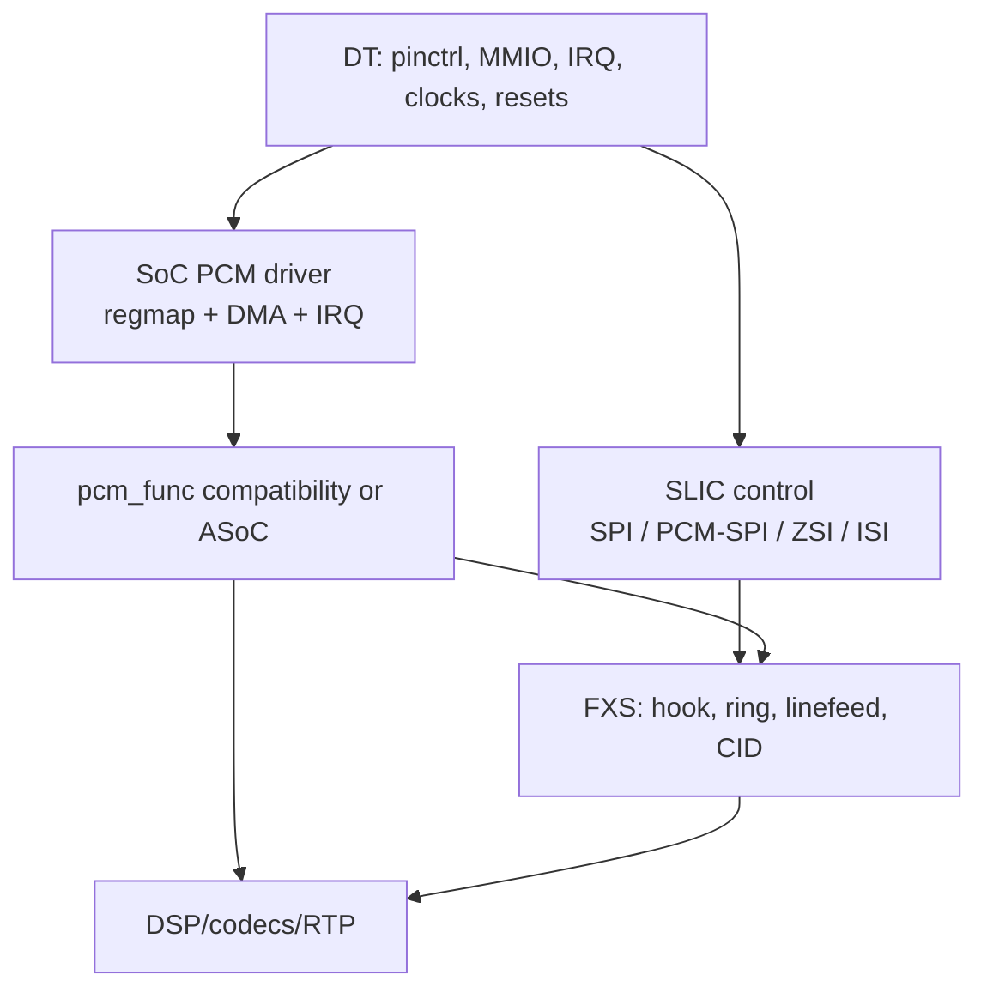

# Airoha/EcoNet pinctrl, clocks, resets, and VoIP/FXS porting gaps

**Language:** English (United States)
**Primary source:** `linux(1).tgz`, Git revision `8f909dac6c5aca0a9c936ce0966a7dce56837427` (`fix ppe in en751221`)
**Compared against:** the previous `analise_voip_fxs_airoha_econet.md` report produced from `sdk_base.tgz`
**Analysis date:** 2026-08-28

## 1. Purpose and scope

This document compares the current kernel's pinctrl drivers, Device Trees, clocks, and resets with the legacy VoIP/FXS modules and Ghidra output analyzed previously. It focuses on the electrical and control path required to port:

- PCM1/PCM2 and audio DMA;
- SPI/PCM-SPI used to configure the SLIC;
- ZSI, ISI, and SLIC reset/interrupt signals;
- clocks and resets for PCM, SFC, and serial wrappers;
- the Device Tree representation of those resources.

This tree does not contain a complete PCM engine driver. The report therefore distinguishes implemented infrastructure from registers and interfaces that are still known only from the legacy modules.

### 1.1 Confidence legend

- **[C] Confirmed:** current C source, binding, DTS, header, or original legacy source.
- **[R] Reverse engineered:** reconstructed from `.ko`/`.ko.c` files and module symbols.
- **[I] Inference:** consistent correlation that still requires a datasheet, board schematic, or bench validation.

## 2. Executive findings

1. **The current pinctrl drivers already describe PCM1, PCM2, and PCM-SPI on almost every SoC.** This confirms that the signals found in the legacy modules are real Chip SCU functions and provides DT-ready group names.

2. **The legacy IOMUX offsets are validated.** In particular:

   - EN751221: legacy logical `0xbfa20104` is physical Chip SCU `0x1fa20000 + 0x104`;
   - EN7528: `0xbfa2015c` is `0x1fa20000 + 0x15c`;
   - EN7523: `0xbfa20214` is `0x1fa20000 + 0x214`.

3. **The legacy reset register at `0xbfb00834` now has explicit semantics.** The reset driver identifies PCM1, PCM2, ZSI/ISI, PCM-SPI, SFC, and SFC2/PCM resets through IDs. The new port should use `reset_control_*()`, never raw writes to `0x834`.

4. **The infrastructure is incomplete for voice.** The tree has no PCM binding, `ecnt-pcm`/`pcm1` engine driver, or `pcm@1fbd0000` node. Pinctrl, reset, and partial clock support do not replace the PCM/DMA engine.

5. **The EN7581 DTS prevents the pinctrl driver from probing.** The DTS uses `airoha,an7581-pinctrl`, while both driver and binding accept `airoha,en7581-pinctrl`.

6. **EN7528 has a driver and DTS but no YAML binding.** A schema for `econet,en7528-pinctrl` is required.

7. **EN7581 and AN7583 overwrite complete mux registers during probe.** This can destroy bootloader configuration for PON, eMMC, SPI, or voice before consumers select their states.

8. **The pinctrl core drops `regmap_update_bits()` errors in `set_mux`.** A failed Chip SCU access is reported as success.

9. **`EN7523_CLK_SLIC` confirms the `0x1c4/0x1c8` offsets found by reverse engineering**, but it is associated with the SLIC/SPI control path. There is not enough evidence to treat it as the PCM bit/frame clock.

10. **The largest data-path incompatibility remains DMA.** EN751221/EN7528 use `0x24`-byte descriptors; EN7523 uses `0x0c`-byte descriptors. Similar pinctrl functions do not imply compatible DMA rings.

## 3. Current material reviewed

| Area                  | Relevant files                                                                                                                       |
| --------------------- | ------------------------------------------------------------------------------------------------------------------------------------ |
| Pinctrl/GPIO/IRQ core | `drivers/pinctrl/airoha/pinctrl-airoha.c`, `airoha-common.h`                                                                         |
| SoC drivers           | `pinctrl-en751221.c`, `pinctrl-en7528.c`, `pinctrl-en7523.c`, `pinctrl-an7563.c`, `pinctrl-an7581.c`, `pinctrl-an7583.c`             |
| Bindings              | `Documentation/devicetree/bindings/pinctrl/{econet,en751221;airoha,en7523;airoha,en7581;airoha,an7563;airoha,an7583}-pinctrl.yaml`   |
| DTS files             | `arch/mips/boot/dts/econet/{en751221,en7528}.dtsi`, `arch/arm/boot/dts/airoha/en7523.dtsi`, `arch/arm64/boot/dts/airoha/en7581.dtsi` |
| Clock/reset           | `drivers/clk/clk-en7523.c`, `include/dt-bindings/{clock,reset}/...`                                                                  |

Kconfig contains selectable variants for EN751221, EN7528, EN7523, AN7563, “AN7581,” and AN7583. For the 7581 variant, the file and Kconfig symbol say AN7581 while the implemented compatible says EN7581.

## 4. Current state versus FXS requirements

| Component              | Current kernel                                              | Porting requirement                                               |
| ---------------------- | ----------------------------------------------------------- | ----------------------------------------------------------------- |
| PCM1/PCM2 pinctrl      | Implemented for all six targets                             | Select board-specific groups and validate conflicts               |
| PCM-SPI pinctrl        | Implemented on EN751221, EN7528, EN7523, EN7581, and AN7583 | AN7563 must use normal SPI or gain a validated mux function       |
| SLIC GPIO/IRQ          | Generic infrastructure implemented                          | Describe reset/INT per board; confirm polarity and debounce       |
| PCM/ZSI/ISI/SFC resets | IDs and provider implemented                                | Consume through the reset framework                               |
| SLIC clock             | Exposed on the ARM-family clock provider                    | Assign the correct consumer; do not confuse it with PCM BCLK      |
| PCM/DMA engine         | Missing                                                     | Implement a platform/ASoC driver or a `pcm_func`-compatible layer |
| PCM binding            | Missing                                                     | Create a schema for each hardware variant                         |
| PCM DT nodes           | Missing                                                     | Add MMIO, IRQ, reset, clock, and pinctrl resources                |
| SLIC/FXS driver        | Missing from the current tree                               | Add Microsemi/Silicon/Lantiq backends and line integration        |
| Legacy `pcm_func` ABI  | Present only in old modules                                 | Optionally preserve as a compatibility boundary                   |

## 5. Common pinctrl architecture

The GPIO block is a `syscon/simple-mfd` at `0x1fbf0200`, spanning `0xc0` bytes. The child pinctrl driver obtains:

- the GPIO regmap from its parent node;
- the Chip SCU regmap through `airoha,chip-scu`;
- IRQ, `gpio-ranges`, pinmux, and pinconf data from DT.

### 5.1 Common GPIO registers

|        Offset | Name                  | Role                         |
| ------------: | --------------------- | ---------------------------- |
|        `0x00` | `GPIO_CTRL`           | direction, two bits per line |
|        `0x04` | `GPIO_DATA`           | low-bank data                |
|        `0x08` | `GPIO_INT`            | low IRQ status, W1C          |
|        `0x0c` | `GPIO_INT_EDGE`       | edge type                    |
|        `0x10` | `GPIO_INT_LEVEL`      | level type                   |
|        `0x14` | `GPIO_OE`             | low-bank output enable       |
|        `0x20` | `GPIO_CTRL1`          | additional direction fields  |
| `0x60`/`0x64` | `GPIO_CTRL2/3`        | additional direction fields  |
|        `0x70` | `GPIO_DATA1`          | high-bank data               |
|        `0x78` | `GPIO_OE1`            | high-bank output enable      |
|        `0x7c` | `GPIO_INT1`           | high IRQ status, W1C         |
| `0x80`–`0x88` | `GPIO_INT_EDGE1/2/3`  | additional edge fields       |
| `0x8c`–`0x94` | `GPIO_INT_LEVEL1/2/3` | additional level fields      |

The core assumes at most 64 GPIOs, 32-line data banks, and 16-line direction/IRQ register groups. It supports active-low/high level interrupts, rising/falling edges, and both edges.

### 5.2 Important behavior

- When a GPIO is requested, the driver clears registered conflicting muxes and sets `FORCE_GPIO_EN` for GPIOs below 32 when the SoC exposes that register.
- Releasing the GPIO clears the force bit.
- `.strict = false`: GPIO and pinmux do not have strict ownership exclusion. A poorly described consumer can reconfigure a pad still used by another block.
- `set_mux()` performs each group write but discards the return value of `regmap_update_bits()`. It should return the first error.
- EN7581 and AN7583 write full values to `hwinit_regs` during probe, before all consumers have applied their pin states.

### 5.3 GPIO and IRQ counts

| SoC      | Effective `ngpio` | Effective IRQs | Evidence/risk                                                         |
| -------- | ----------------: | -------------: | --------------------------------------------------------------------- |
| EN751221 |                64 |             16 | DTS exposes GPIO0..28; advertising 64 lines needs justification       |
| EN7528   |                42 |             16 | Explicit and consistent with `gpio-ranges`                            |
| EN7523   |      64 (default) |   64 (default) | DTS maps 28 GPIOs; default exposes lines without a useful range       |
| AN7563   |      64 (default) |   64 (default) | GPIO/function groups cover a smaller package; validate hardware count |
| EN7581   |      64 (default) |   64 (default) | DTS maps 47 GPIOs                                                     |
| AN7583   |      64 (default) |   64 (default) | GPIO0..52 groups exist; no platform DTS is present                    |

Recommendation: set `num_gpio` and `num_irq` explicitly in every `match_data`, aligned with the documented block and package. `gpio-ranges` constrains pinctrl translation but does not by itself fix the line count advertised by gpiochip.

### 5.4 Drive strength

- EN751221 and EN7528: 4 mA step, encoding 4/8/12/16 mA.
- EN7523, EN7581, AN7563, and AN7583: default 2 mA step, encoding 2/4/6/8 mA.

For PCM/SPI, drive strength must be selected from board loading and signal integrity measurements. A larger value can increase ringing, EMI, and overshoot.

## 6. Device Tree instances

| SoC      | Chip SCU           | GPIO/pinctrl      | Compatible                       | IRQ           | `gpio-ranges` |
| -------- | ------------------ | ----------------- | -------------------------------- | ------------- | ------------- |
| EN751221 | `0x1fa20000/0x400` | `0x1fbf0200/0xc0` | `econet,en751221-pinctrl`        | intc 10       | `<0 13 29>`   |
| EN7528   | `0x1fa20000/0x400` | `0x1fbf0200/0xc0` | `econet,en7528-pinctrl`          | GIC shared 10 | `<0 0 42>`    |
| EN7523   | `0x1fa20000/0x400` | `0x1fbf0200/0xc0` | `airoha,en7523-pinctrl`          | GIC SPI 26    | `<0 12 28>`   |
| EN7581   | `0x1fa20000/0x388` | `0x1fbf0200/0xc0` | **DTS: `airoha,an7581-pinctrl`** | GIC SPI 26    | `<0 13 47>`   |

The correct EN7581 compatible, according to both driver and binding, is `airoha,en7581-pinctrl`.

AN7563 and AN7583 have pinctrl drivers and bindings but no corresponding SoC DTS in this revision.

## 7. Voice-related pin matrix

Numbers below are pinctrl pin numbers; logical GPIO numbers appear in parentheses.

| SoC      | PCM1              | PCM2                            | SLIC control bus                                 | INT/reset/CS                                                                                             |
| -------- | ----------------- | ------------------------------- | ------------------------------------------------ | -------------------------------------------------------------------------------------------------------- |
| EN751221 | 25–28 (GPIO12–15) | 17–20 (GPIO4–7)                 | PCM-SPI 17–20                                    | INT 16/GPIO3; reset 15/GPIO2; CS3 16/GPIO3; CS4 22/GPIO9                                                 |
| EN7528   | 12–15 (GPIO12–15) | 24–27 (GPIO24–27)               | PCM-SPI 4–7 (GPIO4–7)                            | INT GPIO1; reset GPIO2; CS1 GPIO3; CS2 GPIO10; CS3 GPIO23; CS4 GPIO21; CS5 GPIO9; CS6 GPIO28; CS7 GPIO29 |
| EN7523   | 24–27 (GPIO12–15) | 16–19 (GPIO4–7)                 | PCM-SPI GPIO4–7 + GPIO12–15                      | INT GPIO3; reset GPIO2; CS1 GPIO10; CS2 GPIO27; CS3 GPIO8; CS4 GPIO11                                    |
| EN7581   | 22–25 (GPIO9–12)  | 18–21 (GPIO5–8)                 | PCM-SPI GPIO5–12                                 | INT GPIO1; reset GPIO2; CS1 GPIO30; CS2 GPIO27; CS3 GPIO28; CS4 GPIO29                                   |
| AN7563   | GPIO22–25         | GPIO1–4                         | no `pcm_spi` function; primary SPI on pins 32–35 | SPI quad GPIO2/3; CS1 GPIO4                                                                              |
| AN7583   | 10–14 (GPIO8–12)  | 28–31 + 24 (GPIO26–29 + GPIO22) | PCM-SPI 28–31 + 10–13                            | reset 14/GPIO12; CS1 24/GPIO22                                                                           |

### 7.1 Relevant conflicts

- EN751221: `pcm_spi_int` and `pcm_spi_cs3` share pin 16/GPIO3. They cannot be used simultaneously unless the intended mode defines them as the same signal.
- EN751221: `pcm2`, `spi2`, and `pcm_spi` reuse GPIO4–7.
- EN7523 and EN7581: `pcm_spi` aggregates eight signals and overlaps pads used by PCM1/PCM2; verify the expected SLIC topology.
- AN7583: PCM1 and PCM2 groups contain five pads. The fifth pad must be identified from the datasheet before assigning frame, reset, or control semantics.
- I2S, eMMC, PON, LEDs, and JTAG can reuse pads in the same region. A board DTS must never activate two functions on one pad.

## 8. Mux registers and legacy-module correlation

### 8.1 EN751221

**Chip SCU `+0x104`**, physical `0x1fa20104`, legacy MIPS logical `0xbfa20104`:

| Bit | Current function  |
| --: | ----------------- |
|   8 | PCM-SPI CS3       |
|   9 | PCM-SPI CS4       |
|  10 | PCM-SPI reset     |
|  11 | PCM-SPI interrupt |
|  12 | SPI2/PCM-SPI base |
|  13 | PCM1              |
|  14 | PCM2              |
|  19 | SPI quad          |

Correlation with the old `chipScuReg` table:

- PCM mask `0x1000` is bit 12;
- bits labeled ZSI/ISI, `0x2000/0x4000`, are PCM1/PCM2 in current pinctrl terminology;
- SPI/SLIC mask `0x7400` covers reset + PCM-SPI + PCM1 + PCM2;
- reset `0x400` is bit 10;
- bit 9/CS4 is additional information from the current driver and was not covered by the old `0x7d00` mask.

### 8.2 EN7528

**Chip SCU `+0x15c`**, physical `0x1fa2015c`, legacy logical `0xbfa2015c`:

| Bit | Current function  |
| --: | ----------------- |
|  14 | PCM-SPI CS1       |
|  15 | normal SPI CS1    |
|  16 | PCM-SPI reset     |
|  17 | PCM-SPI interrupt |
|  18 | PCM-SPI           |
|  19 | PCM1              |
|  20 | PCM2              |
|  27 | SPI quad          |

CS2–CS7 live at **Chip SCU `+0x224`**, bits 10–15. Driver comments warn that some vendor bit names are displaced by two positions relative to the datasheet signal. Use the driver's group names rather than raw vendor labels.

### 8.3 EN7523

**Chip SCU `+0x214`**, physical `0x1fa20214`, legacy logical `0xbfa20214`:

|   Bit | Current function                    |
| ----: | ----------------------------------- |
|     0 | normal SPI CS1                      |
|     4 | SPI quad                            |
|     8 | PCM-SPI reset                       |
|     9 | PCM-SPI interrupt                   |
|    12 | PCM1                                |
|    13 | PCM2                                |
|    16 | PCM-SPI                             |
|    17 | PCM-SPI CS1                         |
| 18/19 | PCM-SPI CS2, P128/P156 alternatives |
|    20 | PCM-SPI CS3                         |
|    21 | PCM-SPI CS4                         |

This directly confirms the HIR 0x0c entry recovered from the legacy modules.

### 8.4 EN7581, AN7563, and AN7583

These variants did not have equivalent voice-module sets in the previous archive. Current pinctrl is therefore the strongest available evidence:

- EN7581 uses the Chip SCU `0x214`–`0x228` register family, with `GPIO_SPI_CS1_MODE` at `0x218` and `FORCE_GPIO_EN` at `0x228`;
- AN7583 explicitly defines `pcm1`, `pcm2`, `pcm_spi`, `pcm_spi_rst`, and `pcm_spi_cs1` groups;
- AN7563 defines PCM1/PCM2 and SPI but no PCM-SPI function.

Do not reuse EN7523 offsets on EN7581/AN7583 merely because the group names are similar.

## 9. Reset controller: translating `0xbfb00834`

The NP SCU uses `RST_CTRL2 = 0x830` and `RST_CTRL1 = 0x834`. In old MIPS code, `0xbfb00834` was the KSEG1 logical address of `RST_CTRL1`.

| `RST_CTRL1` bit | EN7523/EN7581/AN7583 | EN751221/EN7528    | Voice relationship                             |
| --------------: | -------------------- | ------------------ | ---------------------------------------------- |
|               0 | `PCM1_ZSI_ISI_RST`   | `PCM1_ZSI_ISI_RST` | PCM1 serial wrapper                            |
|               4 | `PCM_SPIWP_RST`      | `PCM2_RST`         | PCM-SPI wrapper on ARM; PCM2 on MIPS           |
|              11 | `PCM1_RST`           | `PCM1_RST`         | PCM1 engine                                    |
|              17 | `PCM2_ZSI_ISI_RST`   | `PCM2_ZSI_ISI_RST` | PCM2 serial wrapper                            |
|              18 | `SFC_RST`            | `SFC_RST`          | serial controller used by legacy manual access |
|              25 | `SFC2_PCM_RST`       | `SFC2_PCM_RST`     | shared SFC2/PCM block                          |

The driver applies approximately 5–6 ms pulses to bits 0, 4, and 17; most other resets use 10–50 µs. Replaying a legacy sequence with arbitrary `udelay()` calls can violate this distinction.

### 9.1 Implementation rule

The new driver should declare `resets`/`reset-names` in DT and obtain controls through `devm_reset_control_get_*()`. A reasonable starting sequence is:

1. select a safe pinctrl state;
2. enable clocks;
3. deassert or pulse serial wrappers;
4. reset the PCM engine;
5. program rings and registers;
6. enable IRQs and transmission.

The final sequence must be validated per variant because bit 4 has different semantics on MIPS and ARM families.

## 10. Related clocks

### 10.1 EN7523/EN7581/AN7583

The provider exposes `EN7523_CLK_SLIC`:

- source selection in `REG_SPI_CLK_FREQ_SEL = 0x1c8`;
- divider in `REG_SPI_CLK_DIV_SEL = 0x1c4`, field 28:24;
- 100 MHz or 3.125 MHz source;
- initial divider value 20, step 2.

On EN7523 the SLIC selector is bit 0 of `0x1c8`; AN7583 uses bit 1. Clock descriptors must remain SoC-specific.

### 10.2 EN751221/EN7528

The primary SPI clock is exposed through Chip SCU `+0x0cc`:

| SoC      |                        Base | Default divisor |
| -------- | --------------------------: | --------------: |
| EN751221 | 500 MHz; 400 MHz on EN7526C |              40 |
| EN7528   |                     400 MHz |              10 |

This is not the same domain as the `0x11c/0x120` offsets observed in legacy PCM/SLIC programming. The domains need separate names and validation.

### 10.3 Missing clock model

No CCF clock is explicitly identified as the PCM bit/frame clock. Before creating the binding, determine whether that clock is:

- internally derived by the PCM block;
- a gate/reset with no separate clock object;
- controlled by the legacy `0x11c/0x120` registers;
- or shared with the SLIC clock on some variants.

## 11. Comparison with the previously documented data path

| Previous report item                  | Confirmation/change in the current kernel                                        |
| ------------------------------------- | -------------------------------------------------------------------------------- |
| PCM physical base `0x1fbd0000`        | Still the strongest hypothesis, but current DTS has no node or driver            |
| EN7523 IRQ GIC SPI 27                 | No current consumer; validate against the interrupt map before merging           |
| Chip SCU `0x104/0x15c/0x214`          | Confirmed by pinctrl drivers                                                     |
| NP SCU `0x834`                        | Confirmed and translated to reset IDs                                            |
| Interfaces 0=SPI, 1=ZSI, 2=ISI, 3=CSI | Still legacy-module evidence; pinctrl exposes PCM/PCM-SPI, not the full ABI enum |
| Manual SFC at `0x1fbd4000`            | SFC/SFC2-PCM resets confirmed; functional driver still missing                   |
| EN751221/EN7528 `0x24` descriptor     | No current implementation; must be implemented in the MIPS variant               |
| EN7523 `0x0c` descriptor              | No current implementation; do not reuse the MIPS ring                            |
| Stable `pcm_func` ABI                 | Can remain a compatibility boundary above the new driver                         |

### 11.1 PCM engine registers that remain useful reverse-engineering input

|        Offset | Reconstructed function                         |
| ------------: | ---------------------------------------------- |
|        `0x00` | PCM control                                    |
| `0x04`–`0x10` | TX slots 0–7                                   |
| `0x14`–`0x20` | RX slots 0–7                                   |
|        `0x24` | interrupt status, observed mask `0x7ff`, W1C   |
|        `0x28` | interrupt mask                                 |
| `0x2c`/`0x30` | TX/RX polling                                  |
| `0x34`/`0x38` | TX/RX ring bases                               |
|        `0x3c` | ring size/configuration                        |
|        `0x40` | DMA control                                    |
| `0x48`–`0xa4` | additional EN7523 slots                        |
|        `0xa8` | unnamed EN7523 register, observed value `0xa0` |
|        `0xac` | EN7523 channel enable, mask `0xf`              |

These should become per-variant register definitions or `regmap_field`s with documented masks and tests, not a literal copy of decompiled code.

## 12. Concrete issues in the current tree

### P0 — blockers

1. Fix `en7581.dtsi`:

   ```dts
   compatible = "airoha,en7581-pinctrl";
   ```

2. Add a binding for `econet,en7528-pinctrl`.
3. Add the PCM engine binding, driver, and DT nodes.
4. Define the SLIC/SFC controller model and separate its clock/reset ownership from the PCM data path.

### P1 — functional and schema correctness

1. The EN7523 binding example says `airoha,en7521-pinctrl`; it must say `airoha,en7523-pinctrl`.
2. The EN7523 schema should require `airoha,chip-scu` and `gpio-ranges`. The driver's fallback looks for `airoha,en7523-chip-scu`, while the actual DTS only supplies generic `airoha,chip-scu`; removing the phandle would make probe fail.
3. EN7523 and EN7581 bindings enumerate eight PCM-SPI groups but set `maxItems: 7`; change it to 8.
4. Schemas accept state nodes ending in `-pins`, while existing DTS files contain nodes named `pon`, `uart2`, and `uart3`. Rename nodes or carefully broaden the pattern.
5. Propagate errors from `airoha_pinmux_set_mux()`.
6. Remove or constrain full-register `hwinit_regs` writes on EN7581/AN7583.
7. Set coherent `num_gpio`/`num_irq` values for every variant.

### P2 — maintenance cleanup

1. Normalize EN7581 naming across file, Kconfig symbol, driver name, and compatible.
2. Document why the fixed primary SPI group exists in pin arrays but is omitted from the `spi` function group list on some variants.
3. Add exclusivity tests for PCM1, PCM2, PCM-SPI, I2S, eMMC, PON, and JTAG.
4. Run `dt_binding_check`, `dtbs_check`, and GPIO IRQ tests on every reference DTS.

## 13. Suggested EN7523 board pinctrl state

The following is a starting point. Chip-select groups depend on the actual SLIC and board routing.

```dts
pcm1_pins: pcm1-pins {
    mux {
        function = "pcm";
        groups = "pcm1";
    };
};

slic_ctrl_pins: slic-ctrl-pins {
    mux {
        function = "pcm_spi";
        groups = "pcm_spi", "pcm_spi_int",
                 "pcm_spi_rst", "pcm_spi_cs1";
    };
};
```

Before adding the PCM node, its binding must answer:

- one or two MMIO resources for PCM and SFC;
- IRQs per engine;
- descriptor format per compatible;
- mandatory resets and ordering;
- bit/frame clock versus SLIC clock;
- slot width, channel count, and master/slave mode;
- relationship among PCM-SPI, ZSI, ISI, and CSI.

Do not attach `EN7523_CLK_SLIC` to the PCM node merely for convenience. Its correct consumer must follow the clock diagram.

## 14. Recommended port architecture



### 14.1 Suggested variant split

Use a `soc_data` structure containing at least:

- channel/slot count;
- extra offsets and masks;
- descriptor layout and size;
- addresses per descriptor;
- ownership/status semantics;
- DMA alignment requirements;
- reset sequence;
- W1C and IRQ quirks;
- PCM2 and serial-interface capabilities.

Avoid SoC `#ifdef`s in the hot path. Descriptor differences are structural and should be selected by `compatible`.

## 15. Bring-up plan

### Phase 1 — repair infrastructure

- fix the EN7581 compatible;
- add the EN7528 binding;
- fix schemas and GPIO/IRQ counts;
- propagate errors and make `hwinit_regs` non-destructive.

### Phase 2 — prove clocks, resets, and pins

- apply only the PCM1 pin state;
- measure BCLK, frame sync, and data with a logic analyzer;
- prove SLIC reset/INT as GPIO before enabling PCM-SPI;
- confirm pad polarity and voltage.

### Phase 3 — minimal PCM engine

- map MMIO with `devm_platform_ioremap_resource()` or regmap;
- obtain IRQ from DT;
- configure one channel/slot only;
- use the DMA API, with no manual KSEG1 conversions;
- validate W1C status and detect underrun/overrun.

### Phase 4 — SLIC/FXS

- implement SLIC ID readout;
- minimal reset and initialization;
- off-hook/on-hook;
- linefeed and ringing;
- then caller ID, gain, tones, and line tests.

### Phase 5 — media

- preserve or replace `pcm_func`;
- local PCM loopback;
- G.711 without advanced DSP;
- only then add LEC, compressed codecs, RTP, and T.38.

## 16. Validation checklist

### Build and schema

- [ ] `make dt_binding_check`
- [ ] `make dtbs_check`
- [ ] no pinctrl state outside the accepted naming pattern
- [ ] every DTS compatible has a driver match and binding
- [ ] coherent `num_gpio`, `gpio-ranges`, and IRQ counts

### Electrical/pinmux

- [ ] no pad shared by two active states
- [ ] board-defined pull-up/down and drive strength
- [ ] SLIC reset remains stable during pinctrl probe
- [ ] bootloader PON/eMMC/SPI state is not destroyed by probe

### PCM/DMA

- [ ] descriptor layout selected by SoC
- [ ] `dma_addr_t` used without truncation
- [ ] correct DMA barriers and synchronization
- [ ] W1C status handling does not lose events
- [ ] rings stop cleanly without late DMA
- [ ] slot order and endianness verified with a known pattern

### Voice

- [ ] repeatable SLIC ID reads
- [ ] hook and ring tested per channel
- [ ] loopback runs at least 30 minutes without loss
- [ ] underrun/overrun counters exposed
- [ ] bit/frame clocks measured at every supported rate

## 17. Open questions

1. Which exact block generates BCLK/FS on each SoC?
2. What signal is the fifth PCM1/PCM2 pad on AN7583?
3. Is PCM-SPI truly absent on AN7563, or only undocumented?
4. Should manual SFC be modeled as a PCM child, an MFD, or a separate controller?
5. Which GPIOs are actually interrupt-capable on EN7523, EN7581, AN7563, and AN7583?
6. Is EN7523 PCM IRQ 27 still correct for this GIC revision?
7. Which commercial boards use SPI, ZSI, ISI, or CSI?

## 18. Practical outcome

The current kernel confirms most of the hardware glue that previously appeared only as magic numbers: IOMUX, reset, and the SLIC clock. This substantially reduces porting risk, but the primary implementation work remains. The safest technical order is:

1. fix pinctrl/DT and schemas;
2. model resets and clocks through kernel APIs;
3. implement the SoC-specific PCM/DMA engine;
4. implement SLIC control;
5. reconnect FXS and the media stack.

The most valuable compatibility boundary remains `pcm_func`; the MMIO/DMA layer of `pcm1` is the part that should be rewritten.
