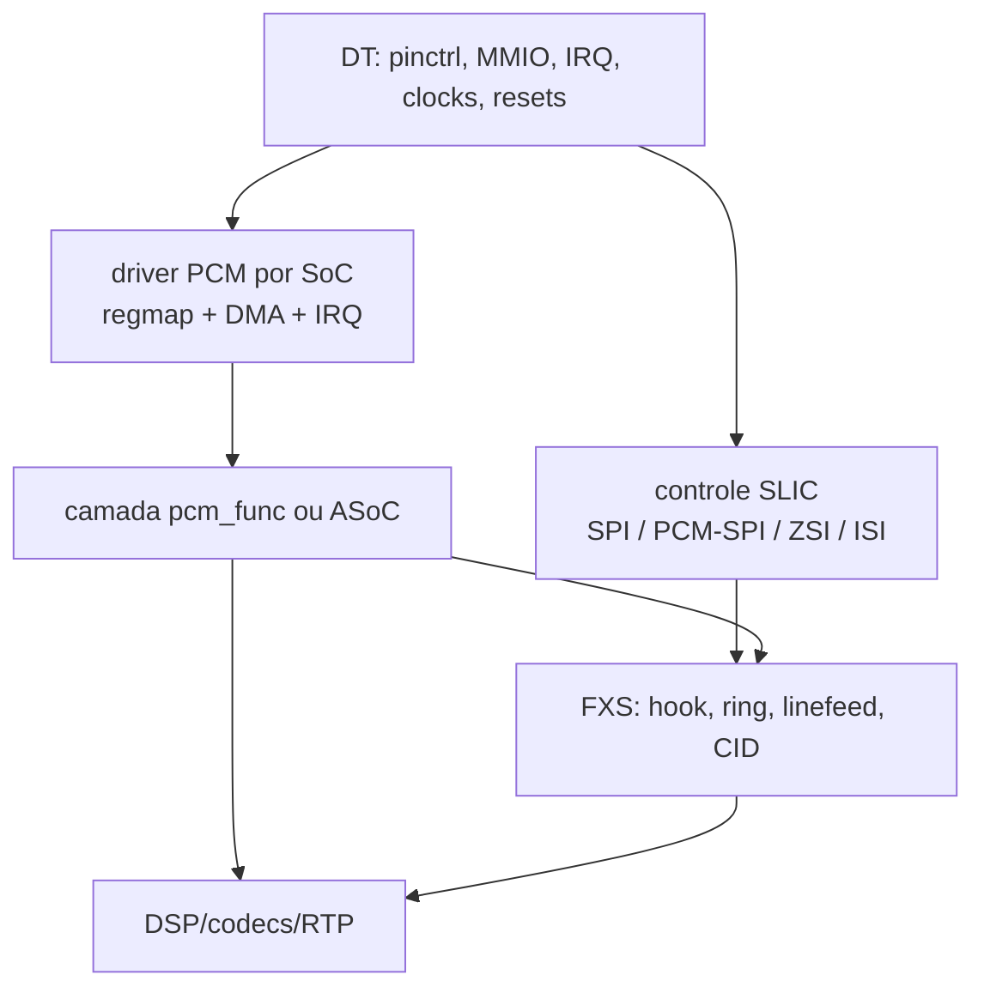

# Pinctrl, clocks, resets e lacunas do porte VoIP/FXS Airoha/EcoNet

**Idioma:** Português (Brasil)
**Fonte principal:** `linux(1).tgz`, revisão Git `8f909dac6c5aca0a9c936ce0966a7dce56837427` (`fix ppe in en751221`)
**Comparação:** relatório anterior `analise_voip_fxs_airoha_econet.md`, produzido a partir de `sdk_base.tgz`
**Data da análise:** 2026-08-28

## 1. Objetivo e limites

Este documento compara os drivers pinctrl, Device Trees, clocks e resets do kernel atual com o que foi recuperado dos módulos VoIP/FXS legados e das saídas do Ghidra. O foco é o caminho elétrico e de controle necessário para portar:

- PCM1/PCM2 e DMA de áudio;
- SPI/PCM-SPI usado para configurar o SLIC;
- ZSI, ISI e sinais de reset/interrupção do SLIC;
- clocks e resets dos blocos PCM, SFC e wrappers seriais;
- descrição desses recursos em Device Tree.

Não existe, nesta árvore, um driver completo do engine PCM. Consequentemente, o documento distingue infraestrutura já implementada de registradores/interfaces ainda reconstruídos apenas dos módulos antigos.

### 1.1 Legenda de confiança

- **[C] Confirmado:** fonte C atual, binding, DTS, header ou código original legado.
- **[R] Reversão:** reconstruído dos `.ko`/`.ko.c` e símbolos dos módulos antigos.
- **[I] Inferência:** correlação consistente, mas que ainda exige datasheet, esquema elétrico ou teste em bancada.

## 2. Conclusões executivas

1. **O pinctrl atual já conhece PCM1, PCM2 e, em quase todos os SoCs, PCM-SPI.** Isto confirma que os sinais observados nos módulos antigos são funções reais do Chip SCU e fornece nomes de grupos utilizáveis no DT.

2. **Os offsets antigos de IOMUX foram validados.** Em particular:

   - EN751221: o lógico legado `0xbfa20104` corresponde ao Chip SCU físico `0x1fa20000 + 0x104`;
   - EN7528: `0xbfa2015c` corresponde a `0x1fa20000 + 0x15c`;
   - EN7523: `0xbfa20214` corresponde a `0x1fa20000 + 0x214`.

3. **O reset legado em `0xbfb00834` agora tem semântica explícita.** O driver de reset identifica PCM1, PCM2, ZSI/ISI, PCM-SPI, SFC e SFC2/PCM por IDs. O novo porte deve usar `reset_control_*()`, nunca gravações diretas em `0x834`.

4. **Há infraestrutura, mas ainda não há suporte de voz completo.** A árvore não contém binding PCM, driver `ecnt-pcm`/`pcm1` nem nó `pcm@1fbd0000`. Pinctrl, reset e parte dos clocks não substituem o engine PCM/DMA.

5. **O DTS do EN7581 impede o probe do pinctrl.** O DTS usa `airoha,an7581-pinctrl`, enquanto driver e binding aceitam `airoha,en7581-pinctrl`.

6. **O EN7528 tem driver e DTS, mas não tem binding YAML.** `econet,en7528-pinctrl` precisa de schema próprio.

7. **O probe do EN7581 e AN7583 sobrescreve registros de mux inteiros.** Essa inicialização pode destruir configuração feita pelo bootloader para PON, eMMC, SPI ou voz antes que os consumidores selecionem seu estado.

8. **O core pinctrl ignora erros de `regmap_update_bits()` em `set_mux`.** Uma falha de acesso ao Chip SCU é reportada como sucesso.

9. **O clock `EN7523_CLK_SLIC` confirma os offsets `0x1c4/0x1c8` vistos na reversão**, mas ele é o clock do caminho de controle do SLIC/SPI. Não há evidência suficiente para tratá-lo como o clock de bit/frame do engine PCM.

10. **A maior incompatibilidade do datapath continua sendo o DMA.** EN751221/EN7528 usam descritores de `0x24` bytes; EN7523 usa descritores de `0x0c` bytes. Pinctrl idêntico não implica ring DMA idêntico.

## 3. Material atual revisado

| Área                  | Arquivos relevantes                                                                                                                  |
| --------------------- | ------------------------------------------------------------------------------------------------------------------------------------ |
| Core pinctrl/GPIO/IRQ | `drivers/pinctrl/airoha/pinctrl-airoha.c`, `airoha-common.h`                                                                         |
| SoCs                  | `pinctrl-en751221.c`, `pinctrl-en7528.c`, `pinctrl-en7523.c`, `pinctrl-an7563.c`, `pinctrl-an7581.c`, `pinctrl-an7583.c`             |
| Bindings              | `Documentation/devicetree/bindings/pinctrl/{econet,en751221;airoha,en7523;airoha,en7581;airoha,an7563;airoha,an7583}-pinctrl.yaml`   |
| DTS                   | `arch/mips/boot/dts/econet/{en751221,en7528}.dtsi`, `arch/arm/boot/dts/airoha/en7523.dtsi`, `arch/arm64/boot/dts/airoha/en7581.dtsi` |
| Clock/reset           | `drivers/clk/clk-en7523.c`, `include/dt-bindings/{clock,reset}/...`                                                                  |

Variantes habilitáveis em Kconfig: EN751221, EN7528, EN7523, AN7563, “AN7581” e AN7583. No caso 7581, o nome de arquivo/símbolo usa AN7581, mas o compatible implementado é EN7581.

## 4. Estado atual versus necessário para FXS

| Componente             | Kernel atual                                               | Necessário para o porte                                            |
| ---------------------- | ---------------------------------------------------------- | ------------------------------------------------------------------ |
| Pinctrl PCM1/PCM2      | Implementado para todos os seis alvos                      | Selecionar grupos por placa e validar conflitos                    |
| PCM-SPI                | Implementado em EN751221, EN7528, EN7523, EN7581 e AN7583  | AN7563 precisa usar SPI normal ou ganhar função após validação     |
| GPIO/IRQ do SLIC       | Infraestrutura genérica implementada                       | Descrever INT/reset por placa; confirmar polaridade e debounce     |
| Resets PCM/ZSI/ISI/SFC | IDs e provider implementados                               | Consumir via reset-controller                                      |
| Clock SLIC             | Exposto no EN7523/EN7581/AN7583 pela família de clocks ARM | Especificar consumidor correto; não confundir com BCLK PCM         |
| Engine PCM/DMA         | Ausente                                                    | Novo driver de plataforma/ASoC ou camada compatível com `pcm_func` |
| Binding do PCM         | Ausente                                                    | Criar schema por variante de hardware                              |
| Nós PCM no DTS         | Ausentes                                                   | Adicionar MMIO, IRQ, resets, clocks e pinctrl                      |
| SLIC/FXS               | Ausente na árvore atual                                    | Backend para Microsemi/Silicon/Lantiq e integração de linha        |
| ABI legado `pcm_func`  | Só existe nos módulos antigos                              | Opcionalmente preservar como camada de compatibilidade             |

## 5. Arquitetura comum do pinctrl

O bloco GPIO é um `syscon/simple-mfd` em `0x1fbf0200`, com janela de `0xc0` bytes. O filho pinctrl obtém:

- o regmap GPIO pelo nó pai;
- o regmap do Chip SCU por `airoha,chip-scu`;
- IRQ, `gpio-ranges`, pinmux e pinconf pelo DT.

### 5.1 Registradores GPIO comuns

|        Offset | Nome                  | Papel                        |
| ------------: | --------------------- | ---------------------------- |
|        `0x00` | `GPIO_CTRL`           | direção, 2 bits por linha    |
|        `0x04` | `GPIO_DATA`           | dados do banco baixo         |
|        `0x08` | `GPIO_INT`            | status IRQ baixo, W1C        |
|        `0x0c` | `GPIO_INT_EDGE`       | tipo de borda                |
|        `0x10` | `GPIO_INT_LEVEL`      | tipo de nível                |
|        `0x14` | `GPIO_OE`             | output enable baixo          |
|        `0x20` | `GPIO_CTRL1`          | direção adicional            |
| `0x60`/`0x64` | `GPIO_CTRL2/3`        | direção adicional            |
|        `0x70` | `GPIO_DATA1`          | dados do banco alto          |
|        `0x78` | `GPIO_OE1`            | output enable alto           |
|        `0x7c` | `GPIO_INT1`           | status IRQ alto, W1C         |
| `0x80`–`0x88` | `GPIO_INT_EDGE1/2/3`  | bordas dos bancos adicionais |
| `0x8c`–`0x94` | `GPIO_INT_LEVEL1/2/3` | níveis dos bancos adicionais |

O core assume no máximo 64 GPIOs, bancos de 32 linhas e grupos de 16 linhas nos registros de direção/IRQ. Suporta nível baixo/alto, borda de subida/descida e ambas as bordas.

### 5.2 Comportamentos importantes

- Ao solicitar um GPIO, o driver limpa muxes conflitantes registrados e ativa `FORCE_GPIO_EN` para GPIOs abaixo de 32 quando o SoC fornece esse registro.
- Ao liberar o GPIO, o bit de force é removido.
- `.strict = false`: pinmux e GPIO não têm exclusividade rígida. Um consumidor mal descrito pode reconfigurar um pad ainda usado por outro bloco.
- `set_mux()` percorre todas as escritas do grupo, mas descarta o retorno de `regmap_update_bits()`. Deve retornar o primeiro erro.
- EN7581 e AN7583 escrevem valores completos nos registros listados em `hwinit_regs` durante o probe. Isso ocorre antes de todos os consumidores aplicarem seus estados.

### 5.3 Contagem de GPIO/IRQ

| SoC      | `ngpio` efetivo | IRQs efetivos | Evidência/risco                                                          |
| -------- | --------------: | ------------: | ------------------------------------------------------------------------ |
| EN751221 |              64 |            16 | DTS expõe GPIO0..28; 64 linhas no gpiochip precisam ser justificadas     |
| EN7528   |              42 |            16 | Explícito e coerente com `gpio-ranges`                                   |
| EN7523   |    64 (default) |  64 (default) | DTS mapeia 28 GPIOs; default expõe linhas sem range útil                 |
| AN7563   |    64 (default) |  64 (default) | Grupos GPIO conhecidos vão até GPIO29/30 conforme função; validar pacote |
| EN7581   |    64 (default) |  64 (default) | DTS mapeia 47 GPIOs                                                      |
| AN7583   |    64 (default) |  64 (default) | Grupos GPIO0..52; não há DTS desta plataforma na árvore                  |

Recomendação: preencher `num_gpio` e `num_irq` explicitamente em cada `match_data`, alinhados à documentação do bloco e ao encapsulamento. `gpio-ranges` limita a tradução pinctrl, mas não corrige sozinho a quantidade anunciada pelo gpiochip.

### 5.4 Drive strength

- EN751221 e EN7528: passo de 4 mA, codificando 4/8/12/16 mA.
- EN7523, EN7581, AN7563 e AN7583: default de 2 mA, codificando 2/4/6/8 mA.

Para PCM/SPI, a força deve ser definida pela placa e pela carga elétrica; “maior” não é automaticamente melhor por causa de ringing, EMI e overshoot.

## 6. Instâncias no Device Tree

| SoC      | Chip SCU           | GPIO/pinctrl      | Compatible                       | IRQ           | `gpio-ranges` |
| -------- | ------------------ | ----------------- | -------------------------------- | ------------- | ------------- |
| EN751221 | `0x1fa20000/0x400` | `0x1fbf0200/0xc0` | `econet,en751221-pinctrl`        | intc 10       | `<0 13 29>`   |
| EN7528   | `0x1fa20000/0x400` | `0x1fbf0200/0xc0` | `econet,en7528-pinctrl`          | GIC shared 10 | `<0 0 42>`    |
| EN7523   | `0x1fa20000/0x400` | `0x1fbf0200/0xc0` | `airoha,en7523-pinctrl`          | GIC SPI 26    | `<0 12 28>`   |
| EN7581   | `0x1fa20000/0x388` | `0x1fbf0200/0xc0` | **DTS: `airoha,an7581-pinctrl`** | GIC SPI 26    | `<0 13 47>`   |

O compatible correto do EN7581, conforme driver e binding, é `airoha,en7581-pinctrl`.

AN7563 e AN7583 têm driver e binding, mas não têm um DTS SoC correspondente nesta revisão.

## 7. Matriz de pinos relevante para voz

Os números abaixo são números de pinctrl; o GPIO lógico aparece entre parênteses.

| SoC      | PCM1              | PCM2                            | Barramento de controle SLIC                       | INT/reset/CS                                                                                             |
| -------- | ----------------- | ------------------------------- | ------------------------------------------------- | -------------------------------------------------------------------------------------------------------- |
| EN751221 | 25–28 (GPIO12–15) | 17–20 (GPIO4–7)                 | PCM-SPI 17–20                                     | INT 16/GPIO3; reset 15/GPIO2; CS3 16/GPIO3; CS4 22/GPIO9                                                 |
| EN7528   | 12–15 (GPIO12–15) | 24–27 (GPIO24–27)               | PCM-SPI 4–7 (GPIO4–7)                             | INT GPIO1; reset GPIO2; CS1 GPIO3; CS2 GPIO10; CS3 GPIO23; CS4 GPIO21; CS5 GPIO9; CS6 GPIO28; CS7 GPIO29 |
| EN7523   | 24–27 (GPIO12–15) | 16–19 (GPIO4–7)                 | PCM-SPI GPIO4–7 + GPIO12–15                       | INT GPIO3; reset GPIO2; CS1 GPIO10; CS2 GPIO27; CS3 GPIO8; CS4 GPIO11                                    |
| EN7581   | 22–25 (GPIO9–12)  | 18–21 (GPIO5–8)                 | PCM-SPI GPIO5–12                                  | INT GPIO1; reset GPIO2; CS1 GPIO30; CS2 GPIO27; CS3 GPIO28; CS4 GPIO29                                   |
| AN7563   | GPIO22–25         | GPIO1–4                         | sem função `pcm_spi`; SPI primário nos pins 32–35 | SPI quad GPIO2/3; CS1 GPIO4                                                                              |
| AN7583   | 10–14 (GPIO8–12)  | 28–31 + 24 (GPIO26–29 + GPIO22) | PCM-SPI 28–31 + 10–13                             | reset 14/GPIO12; CS1 24/GPIO22                                                                           |

### 7.1 Conflitos relevantes

- EN751221: `pcm_spi_int` e `pcm_spi_cs3` compartilham pin 16/GPIO3. Não podem ser usados simultaneamente sem confirmação de que são o mesmo sinal no modo pretendido.
- EN751221: `pcm2`, `spi2` e `pcm_spi` reutilizam GPIO4–7.
- EN7523 e EN7581: `pcm_spi` agrega os grupos de oito sinais e sobrepõe os pads usados por PCM1/PCM2; validar se a função representa o conjunto de controle paralelo/serial esperado pelo SLIC.
- AN7583: PCM1/PCM2 têm cinco pads nos grupos. O quinto pad deve ser identificado no datasheet antes de associá-lo a frame, reset ou controle.
- Em todas as variantes, I2S, eMMC, PON, LEDs e JTAG podem reutilizar pads da mesma região. O DTS da placa deve representar apenas uma função ativa por pad.

## 8. Registradores de mux e correlação com os módulos legados

### 8.1 EN751221

**Chip SCU `+0x104`**, físico `0x1fa20104`, lógico MIPS legado `0xbfa20104`:

| Bit | Função atual      |
| --: | ----------------- |
|   8 | PCM-SPI CS3       |
|   9 | PCM-SPI CS4       |
|  10 | PCM-SPI reset     |
|  11 | PCM-SPI interrupt |
|  12 | SPI2/PCM-SPI base |
|  13 | PCM1              |
|  14 | PCM2              |
|  19 | SPI quad          |

Correlação com `chipScuReg` antigo:

- máscara PCM `0x1000` = bit 12;
- bits chamados ZSI/ISI `0x2000/0x4000` = PCM1/PCM2 no pinctrl atual;
- máscara SPI/SLIC `0x7400` cobre reset + PCM-SPI + PCM1 + PCM2;
- reset `0x400` = bit 10;
- o CS4 em bit 9 é informação adicional do driver atual e não fazia parte da máscara antiga `0x7d00`.

### 8.2 EN7528

**Chip SCU `+0x15c`**, físico `0x1fa2015c`, lógico legado `0xbfa2015c`:

| Bit | Função atual      |
| --: | ----------------- |
|  14 | PCM-SPI CS1       |
|  15 | SPI normal CS1    |
|  16 | PCM-SPI reset     |
|  17 | PCM-SPI interrupt |
|  18 | PCM-SPI           |
|  19 | PCM1              |
|  20 | PCM2              |
|  27 | SPI quad          |

CS2–CS7 ficam em **Chip SCU `+0x224`**, bits 10–15. Os comentários do driver alertam que alguns nomes de bits do vendor estão deslocados em duas posições em relação ao sinal descrito no datasheet; use os nomes de grupo do driver, não o rótulo bruto do bit.

### 8.3 EN7523

**Chip SCU `+0x214`**, físico `0x1fa20214`, lógico legado `0xbfa20214`:

|   Bit | Função atual                        |
| ----: | ----------------------------------- |
|     0 | SPI normal CS1                      |
|     4 | SPI quad                            |
|     8 | PCM-SPI reset                       |
|     9 | PCM-SPI interrupt                   |
|    12 | PCM1                                |
|    13 | PCM2                                |
|    16 | PCM-SPI                             |
|    17 | PCM-SPI CS1                         |
| 18/19 | PCM-SPI CS2, alternativas P128/P156 |
|    20 | PCM-SPI CS3                         |
|    21 | PCM-SPI CS4                         |

Isto confirma diretamente a entrada HIR 0x0c encontrada na reversão.

### 8.4 EN7581, AN7563 e AN7583

Essas variantes não possuíam conjuntos equivalentes de módulos de voz no arquivo anterior. O pinctrl atual é, portanto, a melhor evidência disponível:

- EN7581 usa a família de registros Chip SCU `0x214`–`0x228`, com `GPIO_SPI_CS1_MODE` em `0x218` e `FORCE_GPIO_EN` em `0x228`;
- AN7583 possui grupos explícitos `pcm1`, `pcm2`, `pcm_spi`, `pcm_spi_rst` e `pcm_spi_cs1`;
- AN7563 possui PCM1/PCM2 e SPI, mas não registra uma função PCM-SPI.

Não reutilize offsets do EN7523 no EN7581/AN7583 apenas porque os nomes dos grupos são iguais.

## 9. Reset controller: tradução do `0xbfb00834`

O NP SCU usa `RST_CTRL2 = 0x830` e `RST_CTRL1 = 0x834`. No código MIPS antigo, `0xbfb00834` era o endereço lógico KSEG1 de `RST_CTRL1`.

| Bit em `RST_CTRL1` | EN7523/EN7581/AN7583 | EN751221/EN7528    | Relação com voz                                         |
| -----------------: | -------------------- | ------------------ | ------------------------------------------------------- |
|                  0 | `PCM1_ZSI_ISI_RST`   | `PCM1_ZSI_ISI_RST` | wrapper serial do PCM1                                  |
|                  4 | `PCM_SPIWP_RST`      | `PCM2_RST`         | wrapper PCM-SPI nos ARM; PCM2 nos MIPS                  |
|                 11 | `PCM1_RST`           | `PCM1_RST`         | engine PCM1                                             |
|                 17 | `PCM2_ZSI_ISI_RST`   | `PCM2_ZSI_ISI_RST` | wrapper serial do PCM2                                  |
|                 18 | `SFC_RST`            | `SFC_RST`          | serial flash/controller usado pelo acesso manual legado |
|                 25 | `SFC2_PCM_RST`       | `SFC2_PCM_RST`     | bloco compartilhado SFC2/PCM                            |

O driver aplica pulsos mais longos, de aproximadamente 5–6 ms, aos bits 0, 4 e 17; outros resets usam 10–50 µs. Reproduzir uma sequência antiga com `udelay()` arbitrário pode violar essa diferença.

### 9.1 Regra de implementação

O novo driver deve declarar `resets`/`reset-names` no DT e adquirir os controles com `devm_reset_control_get_*()`. A ordem recomendada é:

1. selecionar estado pinctrl seguro;
2. habilitar clocks;
3. deassert/pulsar wrappers seriais;
4. resetar o engine PCM;
5. programar ring e registradores;
6. habilitar IRQ e transmissão.

A ordem final precisa ser validada por variante, porque o bit 4 não tem a mesma semântica nos MIPS e nos ARM.

## 10. Clocks relacionados

### 10.1 EN7523/EN7581/AN7583

O provider expõe `EN7523_CLK_SLIC`:

- fonte selecionada em `REG_SPI_CLK_FREQ_SEL = 0x1c8`;
- divisor em `REG_SPI_CLK_DIV_SEL = 0x1c4`, campo 28:24;
- fontes de 100 MHz ou 3,125 MHz;
- valor inicial de divisor 20, passo 2.

No EN7523 o seletor SLIC está no bit 0 de `0x1c8`. AN7583 usa bit 1. Os descritores devem ser tratados por SoC.

### 10.2 EN751221/EN7528

O clock SPI principal é exposto pelo Chip SCU em `+0x0cc`:

| SoC      |                        Base | Divisor default |
| -------- | --------------------------: | --------------: |
| EN751221 | 500 MHz; 400 MHz no EN7526C |              40 |
| EN7528   |                     400 MHz |              10 |

Esse clock não é o mesmo domínio dos offsets `0x11c/0x120` observados nos módulos antigos para programação PCM/SLIC. Os domínios devem ser nomeados e validados separadamente.

### 10.3 Lacuna

Não há um clock CCF explicitamente identificado como clock de bit/frame do PCM. Antes de criar um binding, é preciso determinar se esse clock é:

- derivado internamente do bloco PCM;
- um gate/reset sem objeto de clock separado;
- controlado pelos registradores antigos `0x11c/0x120`;
- ou compartilhado com o clock SLIC em alguma variante.

## 11. Comparação com o datapath documentado anteriormente

| Item do relatório anterior            | Confirmação/alteração pelo kernel atual                                                        |
| ------------------------------------- | ---------------------------------------------------------------------------------------------- |
| PCM físico em `0x1fbd0000`            | Continua sendo a hipótese forte, mas o DTS atual não possui nó nem driver                      |
| IRQ EN7523 GIC SPI 27                 | Não há consumidor atual; deve ser validado na tabela de interrupções antes do merge            |
| Chip SCU `0x104/0x15c/0x214`          | Confirmado pelos drivers pinctrl                                                               |
| NP SCU `0x834`                        | Confirmado e agora traduzido em IDs de reset                                                   |
| Interfaces 0=SPI, 1=ZSI, 2=ISI, 3=CSI | Permanece evidência dos módulos; o pinctrl expõe PCM/PCM-SPI, não a enumeração completa do ABI |
| SFC manual em `0x1fbd4000`            | Reset SFC/SFC2-PCM confirmado; driver funcional ainda ausente                                  |
| EN751221/EN7528 descritor `0x24`      | Sem equivalente no kernel atual; deve ser implementado na variante MIPS                        |
| EN7523 descritor `0x0c`               | Sem equivalente no kernel atual; não reutilizar ring MIPS                                      |
| ABI `pcm_func` estável                | Pode permanecer como fronteira de compatibilidade acima do novo driver                         |

### 11.1 Registradores do engine PCM ainda válidos como base de reversão

|        Offset | Função reconstruída                                    |
| ------------: | ------------------------------------------------------ |
|        `0x00` | controle PCM                                           |
| `0x04`–`0x10` | slots TX 0–7                                           |
| `0x14`–`0x20` | slots RX 0–7                                           |
|        `0x24` | status de interrupção, máscara observada `0x7ff`, W1C  |
|        `0x28` | máscara de interrupção                                 |
| `0x2c`/`0x30` | polling TX/RX                                          |
| `0x34`/`0x38` | base dos rings TX/RX                                   |
|        `0x3c` | tamanho/configuração do ring                           |
|        `0x40` | controle DMA                                           |
| `0x48`–`0xa4` | slots adicionais do EN7523                             |
|        `0xa8` | registro EN7523 ainda sem nome, valor observado `0xa0` |
|        `0xac` | enable de canais EN7523, máscara `0xf`                 |

Estes nomes precisam virar um `regmap_field`/header por variante, com máscaras documentadas e testes, não uma cópia literal do decompilado.

## 12. Problemas concretos na árvore atual

### P0 — bloqueadores

1. Corrigir em `en7581.dtsi`:

   ```dts
   compatible = "airoha,en7581-pinctrl";
   ```

2. Criar binding para `econet,en7528-pinctrl`.
3. Criar binding, driver e nós DT para o engine PCM.
4. Definir o modelo do controlador SLIC/SFC e separar seu clock/reset do datapath PCM.

### P1 — correção funcional e de schema

1. O exemplo do binding EN7523 usa `airoha,en7521-pinctrl`; deve usar `airoha,en7523-pinctrl`.
2. EN7523 deve requerer `airoha,chip-scu` e `gpio-ranges`. O fallback do driver procura `airoha,en7523-chip-scu`, enquanto o DTS real usa apenas `airoha,chip-scu`; sem o phandle, o probe falha.
3. Os bindings EN7523 e EN7581 enumeram oito grupos PCM-SPI, mas usam `maxItems: 7`; ajustar para 8.
4. Os schemas aceitam estados que terminam em `-pins`, porém há estados no DTS chamados `pon`, `uart2`, `uart3`. Renomear os nós ou ampliar o padrão de forma controlada.
5. Propagar erros em `airoha_pinmux_set_mux()`.
6. Remover ou restringir as gravações integrais de `hwinit_regs` no EN7581/AN7583.
7. Definir `num_gpio`/`num_irq` coerentes em todas as variantes.

### P2 — limpeza e manutenção

1. Normalizar EN7581: arquivo, Kconfig, nome do driver e compatible devem usar a mesma família.
2. Documentar por que o grupo SPI primário fixo existe nos arrays, mas em algumas variantes não aparece na lista de grupos da função `spi`.
3. Adicionar testes de exclusão entre PCM1, PCM2, PCM-SPI, I2S, eMMC, PON e JTAG.
4. Executar `dt_binding_check`, `dtbs_check` e testes de GPIO IRQ em todos os DTS de referência.

## 13. Estado pinctrl sugerido para uma placa EN7523

O trecho abaixo é um ponto de partida; os grupos de CS dependem do SLIC e do roteamento da placa.

```dts
pcm1_pins: pcm1-pins {
    mux {
        function = "pcm";
        groups = "pcm1";
    };
};

slic_ctrl_pins: slic-ctrl-pins {
    mux {
        function = "pcm_spi";
        groups = "pcm_spi", "pcm_spi_int",
                 "pcm_spi_rst", "pcm_spi_cs1";
    };
};
```

Antes de adicionar o nó PCM, o binding deve responder:

- um ou dois recursos MMIO para PCM e SFC;
- IRQ por engine;
- formato DMA por compatible;
- resets obrigatórios e sua ordem;
- clock de bit/frame e clock do SLIC;
- largura de slot, quantidade de canais e configuração master/slave;
- relação entre PCM-SPI, ZSI, ISI e CSI.

Não associe `EN7523_CLK_SLIC` ao nó PCM por conveniência: o consumidor correto deve ser decidido pelo diagrama de clocks.

## 14. Arquitetura recomendada para o novo porte



### 14.1 Divisão de variante sugerida

Crie uma estrutura `soc_data` com, no mínimo:

- quantidade de canais/slots;
- offsets e máscaras adicionais;
- formato/tamanho do descritor;
- número de endereços por descritor;
- semântica de ownership/status;
- alinhamento e requisitos de DMA;
- sequência de resets;
- quirks de W1C e IRQ;
- suporte a PCM2 e interfaces seriais.

Evite `#ifdef` por SoC no caminho quente. A diferença de descritor é estrutural e deve ser selecionada pelo `compatible`.

## 15. Plano de bring-up

### Fase 1 — corrigir a infraestrutura

- corrigir compatible EN7581;
- adicionar binding EN7528;
- corrigir schemas e contagens GPIO/IRQ;
- propagar erros e tornar `hwinit_regs` não destrutivo.

### Fase 2 — provar clock/reset/pinos

- aplicar somente estado PCM1;
- medir BCLK, FS e dados com analisador lógico;
- provar reset/INT do SLIC como GPIO antes de habilitar PCM-SPI;
- confirmar polaridade e tensão dos pads.

### Fase 3 — engine PCM mínimo

- mapear MMIO com `devm_platform_ioremap_resource()` ou regmap;
- adquirir IRQ pelo DT;
- configurar apenas um canal/slot;
- usar DMA API, sem conversões KSEG1 manuais;
- validar W1C no status e detectar underrun/overrun.

### Fase 4 — SLIC/FXS

- implementar leitura de ID do SLIC;
- reset e init mínimos;
- off-hook/on-hook;
- linefeed e ring;
- depois CID, ganho, tons e testes de linha.

### Fase 5 — mídia

- preservar ou substituir `pcm_func`;
- loopback PCM local;
- G.711 sem DSP avançado;
- somente depois LEC, codecs comprimidos, RTP e T.38.

## 16. Checklist de validação

### Build e schema

- [ ] `make dt_binding_check`
- [ ] `make dtbs_check`
- [ ] nenhum nó pinctrl fora do padrão aceito
- [ ] todos os compatibles do DTS possuem match e binding
- [ ] `num_gpio`, `gpio-ranges` e IRQs coerentes

### Elétrica/pinmux

- [ ] nenhum pad compartilhado por dois estados ativos
- [ ] pull-up/down e drive strength definidos pela placa
- [ ] reset do SLIC permanece estável durante o probe
- [ ] bootloader não deixa PON/eMMC/SPI em estado destruído pelo pinctrl

### PCM/DMA

- [ ] formato de descritor selecionado por SoC
- [ ] `dma_addr_t` usado sem truncamento
- [ ] barreiras e sincronização DMA corretas
- [ ] status W1C não perde eventos
- [ ] ring para limpo sem DMA tardio
- [ ] slots e endian validados com padrão conhecido

### Voz

- [ ] ID do SLIC lido de forma repetível
- [ ] hook e ring testados por canal
- [ ] loopback sem perda por pelo menos 30 minutos
- [ ] underrun/overrun contabilizados
- [ ] clock/frame medidos em todas as taxas suportadas

## 17. Questões ainda abertas

1. Qual é o bloco exato que gera BCLK/FS em cada SoC?
2. O quinto pad de PCM1/PCM2 no AN7583 representa qual sinal?
3. No AN7563, PCM-SPI é realmente ausente ou apenas ainda não descrito?
4. O recurso SFC manual deve ser filho do PCM, um MFD ou um controlador separado?
5. Quais GPIOs são realmente interrupt-capable em EN7523, EN7581, AN7563 e AN7583?
6. O IRQ 27 do PCM EN7523 permanece correto nesta revisão do GIC?
7. Quais variantes usam SPI, ZSI, ISI ou CSI em cada placa comercial?

## 18. Resultado prático

O kernel atual confirma a maior parte da “cola” de hardware que antes aparecia apenas como números mágicos: IOMUX, reset e clock SLIC. Isso reduz o risco do porte, mas não elimina o trabalho principal. A ordem técnica mais segura é:

1. corrigir pinctrl/DT e schemas;
2. modelar resets e clocks por API;
3. implementar o engine PCM/DMA por variante;
4. implementar o controle do SLIC;
5. reconectar FXS e a pilha de mídia.

O ponto de compatibilidade mais valioso continua sendo `pcm_func`; o ponto que deve ser totalmente refeito é a camada MMIO/DMA do `pcm1`.
