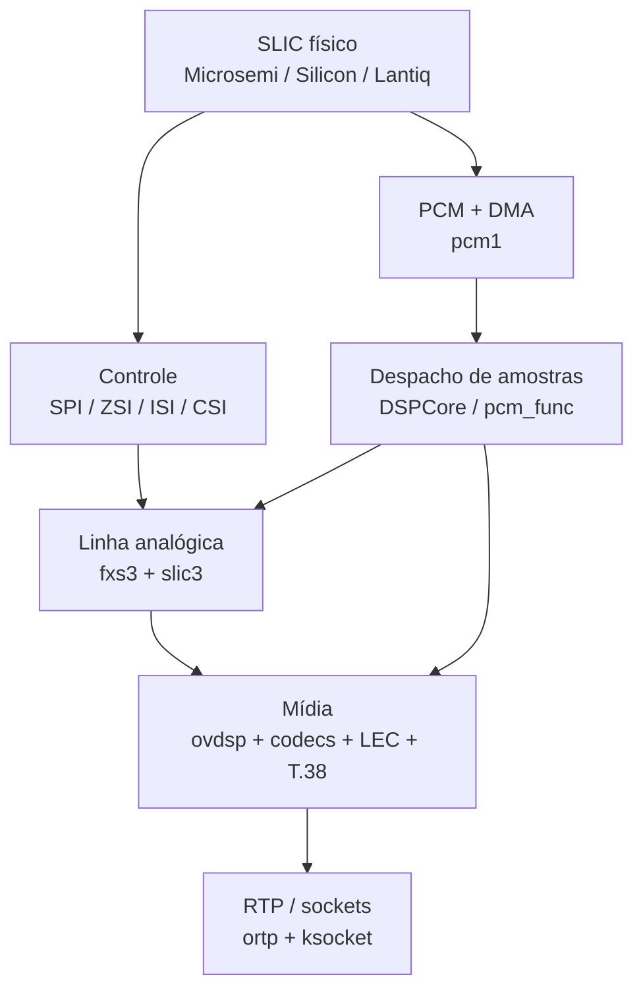

# Análise comparativa dos módulos VoIP/FXS Airoha/EcoNet

**Arquivo analisado:** `sdk_base.tgz`
**Escopo principal:** módulos `.ko`, saídas `.ko.c` do Ghidra, fontes privados recuperados do histórico Git e fontes abertos presentes no `HEAD`
**Plataformas com binários de voz:** EN751221, EN7528 e EN7523
**Data da análise:** 2026-08-28

## 1. Resumo executivo

Os três conjuntos analisados preservam praticamente a mesma arquitetura de software de voz, apesar de atravessarem três combinações de CPU/kernel:

| Família analisada | CPU / endian           | Kernel do módulo | Forma do driver PCM                                 |
| ----------------- | ---------------------- | ---------------- | --------------------------------------------------- |
| EN751221          | MIPS32r2 big-endian    | 2.6.36           | MMIO KSEG1 direto, IRQ fixo, descritor antigo       |
| EN7528            | MIPS32r2 little-endian | 3.18.21          | MMIO KSEG1 direto, IRQ fixo, descritor antigo       |
| EN7523            | ARMv7 little-endian    | 4.4.115          | recursos vindos do DT, DMA coerente, descritor novo |

A conclusão mais importante para o porte é: **o ABI interno e a divisão dos módulos foram mantidos; o que realmente mudou foi a camada de hardware**. `DSPCore`, `pcm_func`, `fxs3`, `slic3`, `ovdsp`, `acodec_x`, `foip` e `ortp` continuam exercendo papéis equivalentes. Os pontos que não podem ser copiados cegamente são:

1. clock, PLL, reset e IOMUX;
2. IRQ e tratamento W1C do status;
3. formato dos descritores DMA;
4. conversão de endereços físicos/cacheados;
5. bloco SPI/SFC usado para controlar o SLIC;
6. seleção da interface física SPI, ZSI, ISI ou CSI.

O salto mais perigoso é o descritor PCM:

- EN751221/EN7528: 15 descritores de `0x24` bytes, cada um com status e oito endereços de buffer;
- EN7523: 15 descritores de `0x0c` bytes, cada um com status, bitmap de canais de 32 bits e um único endereço físico.

Portanto, manter o ABI `pcm_func` é viável, mas reutilizar a implementação DMA do MIPS no EN7523 corromperia o ring imediatamente.

## 2. Legenda de confiança

- **[C] Confirmado:** fonte C original, header, Device Tree, símbolos/estruturas ELF ou strings inequívocas.
- **[R] Reversão:** comportamento reconstruído de `.ko.c`, símbolos e dados do módulo.
- **[I] Inferência:** nome ou papel deduzido por padrão de acesso; precisa ser validado no datasheet/esquema/hardware.

Os endereços `0xbf...` do código MIPS são endereços virtuais KSEG1. No ARM, os mesmos números também aparecem nos módulos decompilados, mas funcionam como **endereços lógicos legados despachados por wrappers**, e não como MMIO ARM que deva ser dereferenciado diretamente.

## 3. Material encontrado

O arquivo continha um repositório Git empacotado. O `HEAD` é `89c10683` (`Add Microsemi datasheet`). A sequência relevante do histórico é:

| Commit     | Data/mensagem                    | Relevância                                                                          |
| ---------- | -------------------------------- | ----------------------------------------------------------------------------------- |
| `d03104b5` | `add econet private code driver` | contém `private_econet/voip_2.6.36` com a árvore de voz completa de fornecedores    |
| `3b0be573` | `add code for en7516/en7528`     | adiciona variantes novas e remove do estado corrente boa parte do fonte VoIP antigo |
| `94fb26ea` | `ghidra code`                    | adiciona decompilações                                                              |
| `474ea2dd` | `ghidra code for en751221`       | adiciona o conjunto EN751221                                                        |
| `ca526fa3` | `add kernel module files`        | adiciona os `.ko` correspondentes                                                   |

No `HEAD` existem 889 arquivos `.ko`/`.ko.c`. A triagem por voz/FXS/PCM/SLIC encontrou 239 caminhos relevantes; há duplicações exatas entre imagens/operadoras. Em particular, vários binários EN751221 de `tc1` e `tc2` são idênticos, e o conjunto `reverse/fxs_xx230v_ghidra` repete a variante EN7523 `xx230v`.

Conjuntos principais:

- `reverse/en751221/mitra-2741gnac-n1/`
- `reverse/en751221/nokia-g_240g_e/`
- `reverse/en7528-xc220-g3v/`
- `reverse/en7523/{ghidra,kernel_modules}/{askey,mitrastar,xx230v}/`
- `private_econet/voip_2.6.36/` no commit `d03104b5`

Os módulos não estão stripped e mantêm `.symtab`, o que aumenta bastante a confiança dos nomes de função e das relações import/export. O campo `.modinfo depends` está vazio; a dependência real foi reconstruída pela interseção entre símbolos indefinidos e exportados.

## 4. Arquitetura comum



### 4.1 Papéis dos módulos

| Módulo             | Papel comum                                                                      |
| ------------------ | -------------------------------------------------------------------------------- |
| `pcm1`             | configura PCM, slots, ring DMA, interrupções e entrega/recebe buffers            |
| `DSPCore`          | mantém listeners/filas de PCM e publica o ABI `pcm_func`                         |
| `spi`              | acesso de controle ao SLIC por SPI normal, SFC manual, ZSI, ISI ou CSI           |
| `slic3`            | VoicePath/Microsemi-Zarlink; inicialização e operação do SLIC                    |
| `slic3_silicon`    | ProSLIC/Silicon Labs/Skyworks; inclui MLT em vários builds                       |
| `slic3_intel`      | DUSLIC XS/Lantiq/Intel, normalmente pela interface CSI                           |
| `fxs3`             | abstração comum de linha: hook, ring, linefeed, ganho, CID, tons e testes        |
| `lec`              | cancelamento de eco                                                              |
| `acodec_x`         | G.711, G.722, G.723, G.726, G.729 e comfort noise                                |
| `foip`             | fax/T.38, incluindo FR38                                                         |
| `ovdsp`            | orquestra canais, streams, codecs, eventos, fax e mídia                          |
| `ortp` + `ksocket` | RTP e transporte via sockets do kernel                                           |
| `sif`              | mestre I²C legado do SoC; não é o barramento PCM/SLIC                            |
| `voip`             | cdev/timers e, no EN7523, regras/marcação de tráfego; não é o datapath principal |

### 4.2 Dependências reais por símbolos

As ligações mais estáveis entre as três gerações são:

- `pcm1` importa filas/callbacks do `DSPCore`;
- `slic3*` importa as primitivas de `spi`;
- `fxs3*` depende de `slic3*`, `DSPCore` e `lec`;
- `lec` depende do `DSPCore`;
- `ortp` depende de `DSPCore`, `ksocket` e `fxs3`;
- `ovdsp` agrega `DSPCore`, `acodec_x`, `foip`, `fxs3`, `ksocket`, `ortp` e, nos builds novos, `lec`;
- nos builds mais novos, `spi` importa de `pcm1` as tabelas de SCU/reset e, no ARM, também usa os wrappers `regReadArm`/`regWriteArm` do `DSPCore`.

No EN7523, por exemplo, foram observadas 99 referências de `ovdsp` a exports de `ortp`, 23 a `fxs3`, 13 a `DSPCore`, 6 a `ksocket`, 6 a `acodec_x` e 6 a `foip`. Isso confirma que `ovdsp` é o orquestrador, não o driver de hardware.

## 5. ABI PCM preservado

O objeto `pcm_func` expõe quase a mesma fachada nas três gerações:

```c
pcmRecvFuncRegister(...);
pcmRecv(...);
pcmSendBufAlloc(...);
pcmSend(...);
pcmRecvChBufFree(...);
pcmTxBufKfree(...);
reInitPcm(...);
pcmRecvSampleSizeGet(...);
timeSlotCfgReinit(...);
pcmBitDelaySet(...);
flushDlRtpQueueRegister(...);
pcmDMAStop(...);
pcmConfig(...);
pcmRestart(...);
```

Versões novas adicionam `isTxDescEmpty`. As assinaturas que o Ghidra produziu devem ser tratadas com cautela, mas os nomes/exportações e os chamadores confirmam o papel dessas entradas.

Esse ABI é um bom limite de compatibilidade para o primeiro porte: uma nova implementação de `pcm1` pode continuar alimentando módulos de DSP já existentes, desde que sejam recompiláveis/compatíveis com o kernel-alvo.

## 6. Mapa do PCM

### 6.1 Recursos do bloco

**[C] MIPS legado:**

- PCM1 lógico: `0xbfbd0000`
- PCM2 lógico: `0xbfbd2000`
- IRQ PCM1: 12 em builds `CONFIG_MIPS_TC3262`; fallback histórico 28
- IRQ PCM2: 34

**[C] EN7523/ARM via Device Tree:**

- `compatible = "econet,ecnt-pcm"`
- recurso físico: `0x1fbd0000`, tamanho `0x4fff`
- GIC SPI 27
- alguns DTS chamam o nó de `pcm@bfbd0000`, embora `reg` use o endereço físico correto

O arquivo aberto `linux/arch/{arm,arm64}/mach-econet/ecnt_pcm.c` é apenas um provedor de recurso: mapeia MMIO/IRQ e exporta `GET_PCM_REG`, `SET_PCM_REG`, `get_pcm_irq` e `get_pcm_dev`. Ele **não contém o engine PCM/DMA**, que permanece nos módulos fechados.

### 6.2 Registradores comuns

Offsets e máscaras reconstruídos da tabela `regMap` dos `.ko` e confrontados com `pcmdriver.h`:

| Offset | Nome funcional  | Máscara observada | Uso                                                    |
| -----: | --------------- | ----------------: | ------------------------------------------------------ |
| `0x00` | PCM control     |      `0x1f7f1f1f` | habilitação/configuração, validade, reset, clock/frame |
| `0x04` | TX slot cfg 0/1 |      `0x13ff13ff` | slots TX                                               |
| `0x08` | TX slot cfg 2/3 |      `0x13ff13ff` | slots TX                                               |
| `0x0c` | TX slot cfg 4/5 |      `0x13ff13ff` | slots TX                                               |
| `0x10` | TX slot cfg 6/7 |      `0x13ff13ff` | slots TX                                               |
| `0x14` | RX slot cfg 0/1 |      `0x13ff13ff` | slots RX                                               |
| `0x18` | RX slot cfg 2/3 |      `0x13ff13ff` | slots RX                                               |
| `0x1c` | RX slot cfg 4/5 |      `0x13ff13ff` | slots RX                                               |
| `0x20` | RX slot cfg 6/7 |      `0x13ff13ff` | slots RX                                               |
| `0x24` | ISR             |      `0x000007ff` | status; eventos DMA/PCM                                |
| `0x28` | IMR             |      `0x000007ff` | máscara de interrupção                                 |
| `0x2c` | TX poll         |      `0xffffffff` | escrever `1` publica/aciona TX                         |
| `0x30` | RX poll         |      `0xffffffff` | escrever `1` publica/aciona RX                         |
| `0x34` | TX ring base    |      `0xffffffff` | endereço físico/tag do ring TX                         |
| `0x38` | RX ring base    |      `0xffffffff` | endereço físico/tag do ring RX                         |
| `0x3c` | Ring size       |      `0x000000ff` | tamanho/configuração do ring                           |
| `0x40` | DMA control     |      `0x0000000f` | bits baixos de DMA TX/RX                               |

Valores iniciais comuns dos slots TX são `0x00080000`, `0x00180010`, `0x00280020` e `0x00380030`, codificando pares sequenciais. RX segue o mesmo padrão. O controle aparece com default `0x0500040a`.

No DMA control, o inicializador ELF parece `0x0f000000` nos módulos em mais de uma combinação de endian, enquanto o código manipula os quatro bits baixos. Isso é um alerta de endian/forma de acesso: **não use o valor bruto do inicializador como programação de hardware sem confirmar no SoC**.

### 6.3 Extensão do EN7523 para 32 canais

O `regMap` EN7523 cresce de 17 para 42 entradas. Além das oito configurações iniciais, há:

| Faixa        | Função                                                                    |
| ------------ | ------------------------------------------------------------------------- |
| `0x48..0x74` | 12 registradores TX adicionais, completando 16 pares/32 canais            |
| `0x78..0xa4` | 12 registradores RX adicionais, completando 16 pares/32 canais            |
| `0xa8`       | registrador sem nome no material; escrito com `0xa0` durante init **[R]** |
| `0xac`       | channel enable, máscara/default `0x0f` **[R]**                            |

Os pares adicionais seguem o mesmo padrão de slots sequenciais até `0xf0/0xf8`.

### 6.4 Bits/eventos de interrupção

Definições do header antigo:

| Bit |    Valor | Evento               |
| --: | -------: | -------------------- |
|   0 | `0x0001` | frame boundary       |
|   2 | `0x0004` | TX descriptor update |
|   3 | `0x0008` | RX descriptor update |
|   4 | `0x0010` | end TX descriptor    |
|   5 | `0x0020` | end RX descriptor    |
|   6 | `0x0040` | TX underrun          |
|   7 | `0x0080` | RX overrun           |
|   8 | `0x0100` | AHB/bus error        |
|   9 | `0x0200` | timeout              |
|  10 | `0x0400` | hunt error           |
|  11 | `0x0800` | ZSI                  |
|  12 | `0x1000` | ISI                  |
|  13 | `0x2000` | SFC                  |
|  14 | `0x4000` | external SLIC init   |

Há uma inconsistência histórica útil: a máscara comum de ISR/IMR no `regMap` é `0x7ff`, portanto os bits `0x800` e superiores ficam fora da máscara registrada. Eles podem pertencer a extensões/revisões ou ser tratados por outro caminho. Isso precisa ser testado no silício e não apenas copiado do header.

### 6.5 Controle e configuração

`pcm_ext_conf.h` descreve campos para:

- loopback;
- `cfgValid`;
- soft reset;
- frame count, até 31;
- ordem de bytes e bits;
- bit delay;
- borda de dados;
- borda e comprimento de frame sync;
- sample clock;
- bit clock de 256 a 8192 kHz;
- master/slave.

O código decompilado confirma:

- `prepcmCfgValid` limpa o bit 26 (`0x04000000`) do controle;
- `postpcmCfgValid` volta a setar o bit 26;
- o soft reset antigo usa o bit 24 do controle em algumas variantes;
- em SoCs reconhecidos, também aparece o reset do bloco por NP SCU `0xbfb00834`, bit 11.

Não se deve reconstruir posições de campos apenas a partir de bitfields C: layout de bitfield depende do compilador/endian. Para o porte, usar máscaras explícitas confirmadas pelo binário.

## 7. Descritores DMA: diferença crítica

### 7.1 EN751221 e EN7528

**[C/R]** Cada ring aloca `0x21c` bytes:

```text
15 descritores × 0x24 bytes = 0x21c
```

Layout reconstruído:

```c
struct pcm_desc_old {
    u32 status;
    u32 buf_addr[8];
};
```

Características:

- oito canais/buffers por descritor;
- ownership no status;
- máximo histórico de 8 canais;
- sample count máximo definido como 1020;
- largura de 8/16 bits e buffer máximo de 2040 bytes;
- conversão MIPS físico/KSEG usando máscara `0x1fffffff`.

### 7.2 EN7523

**[R]** Cada ring aloca `0xb4` bytes:

```text
15 descritores × 0x0c bytes = 0xb4
```

Layout reconstruído:

```c
struct pcm_desc_new {
    u32 status;      /* ownership no bit 31; sample size nos 10 bits baixos */
    u32 channel_map; /* até 32 canais */
    u32 buf_addr;    /* um endereço físico */
};
```

O driver usa alocação/mapeamento DMA coerente e programa o ring com algo equivalente a:

```c
(phys & 0x3fffffff) + 0x80000000
```

Na inicialização também escreve `0x3f` em ring size e `0xa0` em `PCM+0xa8`. Esses valores devem virar constantes por variante após validação, não defaults globais.

### 7.3 Consequência para o porte

Criar uma camada de operações por SoC, por exemplo:

```c
struct ecnt_pcm_soc_data {
    unsigned int channels;
    unsigned int desc_size;
    void (*desc_init)(...);
    void (*desc_submit)(...);
    void (*desc_reclaim)(...);
    void (*clock_setup)(...);
};
```

Evitar structs com bitfields e evitar `u32` para endereços DMA no código moderno; usar `dma_addr_t`, `READ_ONCE`/`WRITE_ONCE`, barreiras DMA e APIs `dma_alloc_coherent`/`dma_map_*` apropriadas.

## 8. IRQ por geração

| SoC/binário |                 IRQ observado | Modelo                                                     |
| ----------- | ----------------------------: | ---------------------------------------------------------- |
| EN751221    |                            12 | direto; também chama `set_vi_handler(0xc)`                 |
| EN7528      |                   `0x25` = 37 | direto                                                     |
| EN7523      | obtido por `get_pcm_irq()`/DT | `request_threaded_irq`; afinidade para máscara CPU 1/bit 1 |

No EN7523, strings ainda citam o número legado 28, mas a fonte aberta e o DTS devem prevalecer. O DTS declara GIC SPI 27; o número Linux final depende do domínio de IRQ.

O handler novo deve:

1. ler ISR uma vez;
2. mascarar somente eventos habilitados;
3. confirmar no manual quais bits são W1C;
4. contabilizar underrun, overrun, timeout e bus error;
5. publicar/recolher descritores com barreiras DMA;
6. nunca assumir que `irq == 28`.

## 9. SCU, IOMUX, clocks e resets

### 9.1 Tradução de endereços no ARM

`DSPCore` EN7523 implementa `regReadArm`/`regWriteArm` como uma camada de compatibilidade:

| Faixa lógica legada         | Destino real                  |
| --------------------------- | ----------------------------- |
| `0xbfbd0000..0xbfbd4fff`    | `GET_PCM_REG` / `SET_PCM_REG` |
| `0xbfb00000..0xbfb0095f`    | NP SCU wrappers               |
| `0xbfa20000..0xbfa2035f`    | CHIP SCU wrappers             |
| `0xbfbf0114` / `0xbfbf0118` | wrappers especiais de timer   |

Os DTS mapeiam NP SCU em `0x1fb00000` e CHIP SCU em `0x1fa20000` no EN7523. Logo, portar um `*(volatile u32 *)0xbf...` para ARM/ARM64 está errado mesmo quando o decompilado parece fazer isso.

### 9.2 Identificação do chip

No MIPS, `GET_HIR()` lê os 16 bits altos de `0xbfb00064`. O SDK nomeia:

|    HIR | Família        |
| -----: | -------------- |
| `0x07` | EN7512/EN7521  |
| `0x08` | EN7526C/EN7522 |
| `0x09` | EN7516/EN7527  |
| `0x0a` | EN7580         |
| `0x0b` | EN7528         |
| `0x0c` | EN7523         |
| `0x0e` | EN7581         |
| `0x0f` | AN7552         |
| `0x10` | AN7583         |

O valor `0x0d` é usado em ramificações dos módulos EN7523 decompilados, mas não possui nome em `ecnt_chip_id.h`. Deve permanecer como variante desconhecida até haver header/datasheet específico.

### 9.3 Tabela `chipScuReg`

Os módulos `pcm1` novos carregam uma tabela com quatro entradas de 14 palavras. O significado das últimas oito palavras é confirmado pelo header antigo; os rótulos das palavras intermediárias são parcialmente inferidos pelo uso.

Ordem reconstruída:

```text
[iomux, pcm_clk_out, pcm_clk_src, clk_cfg?, spi_clk?, aux_clk?,
 zsi_pcm_src_mask, pcm_pin_mode, zsi_isi_1st, zsi_isi_2nd,
 spi_slic_1st, spi_slic_2nd, pcm_reset, iomux_mask]
```

Tabela ARM/EN7523:

| Entrada | 14 valores em ordem                                                                                                             |
| ------: | ------------------------------------------------------------------------------------------------------------------------------- |
|       0 | `bfa20104 bfa200d8 bfa20148 bfa200d4 bfa200cc bfa201f4 0000000c 00001000 00002000 00004000 00007400 00000100 00000400 00007d00` |
|       1 | `bfa2015c bfa20130 bfa20130 bfa2012c bfa2011c bfa20120 00000c00 00000400 00000800 00001000 001d0000 00020000 00010000 001f4000` |
|       2 | `bfa20214 bfa201cc bfa201cc bfa201c8 bfa201b8 bfa201bc 00000c00 00000100 00001000 00002000 00011300 01fe0000 00010000 01ff3300` |
|       3 | `bfa20214 bfa201d0 bfa201d0 bfa201cc bfa201c4 bfa201c8 00000c00 00000100 00001000 00002000 00011300 003e0000 00010000 003f3300` |

Seleção observada no EN7523:

- HIR `0x0a`: entrada 2;
- HIR `0x0c`: entrada 3;
- demais, inclusive o ramo `0x0d`: entrada 0.

Isso não significa que a entrada 0 seja segura para qualquer SoC desconhecido; é apenas o comportamento do módulo examinado.

No EN7528, as entradas 0–2 coincidem; a entrada 3 é:

```text
bfa2015c bfa20130 bfa20130 bfa2012c bfa2011c bfa20120
00000c00 00000400 00000800 00001000 000f0000 00104000
00010000 001f4000
```

### 9.4 Tabela `slicResetReg`

Cada entrada contém cinco palavras, usadas como dois registradores de mux/modo, máscara a limpar e bits de seleção para GPIO30/GPIO31.

ARM/EN7523:

| Entrada | Valores                                        |
| ------: | ---------------------------------------------- |
|       0 | `bfa20104 bfa20104 00000400 00001000 00002000` |
|       1 | `bfa2015c bfa2015c 00000100 10000000 20000000` |
|       2 | `bfa20218 bfa20214 00000100 00020000 00040000` |
|       3 | `bfa20218 bfa20214 00000100 00020000 00040000` |

EN7528 reutiliza as entradas 0–2 e, na entrada 3, repete a forma da entrada 1.

### 9.5 Resets diretos observados

No NP SCU `0xbfb00834` lógico aparecem:

| Bit | Uso observado                                             |
| --: | --------------------------------------------------------- |
|   0 | reset SLIC/ZSI/ISI comum no fonte antigo                  |
|   4 | caminho especial da variante HIR `0x0c` em alguns módulos |
|  11 | soft reset do PCM                                         |
|  17 | reset adicional de SLIC/interface serial                  |
|  25 | reset do SPI normal em variantes novas                    |

Também são usados GPIOs:

- controle/direção: `0xbfbf0200`;
- dados: `0xbfbf0204`;
- open-drain: `0xbfbf0214`;
- mux/modo adicional: `0xbfbf0220`.

Algumas placas resetam o SLIC por GPIO30/31; outras por GPIO9. O esquema da placa é a fonte de verdade.

### 9.6 PLL/clock especiais

**EN7523, ramo HIR `0x0c` [R]:**

- escreve `0x80` em `0xbfa20264`;
- testa bit 19 de `0xbfa20254`;
- escolhe template `0x6c226808` em `0xbfa202d4` ou `0x5681ecd4` em `0xbfa202d0`;
- preserva/toggle bit 0 de `0xbfa202d0`;
- limpa `0xbfa20264` ao final.

**EN7528, caminho FNPLL/PON [R]:**

- `0xbfa2012c = 0x00143010`;
- `0xbfa20120 = 0x1020`, depois `0x1050`;
- espera `0xbfa20130 bit 0`, com timeout de aproximadamente 21 ms;
- programa a sequência `0x50`, `0x10050`, `0x110050`, `0x03110050`, `0x33110050`;
- finaliza com `0xbfa2012c = 0x00143011`.

Essas sequências são magic numbers dependentes de revisão. No driver novo, devem ser descritas por `soc_data`/clock provider e só usadas depois de confirmar taxa e estabilidade com osciloscópio.

## 10. SPI, ZSI, ISI e CSI

### 10.1 Significado do parâmetro de interface

O fonte antigo e a string do `spi.ko` EN7523 concordam:

| `interface_type` | Interface | Fornecedor mais associado |
| ---------------: | --------- | ------------------------- |
|                0 | SPI       | genérico                  |
|                1 | ZSI       | Zarlink/Microsemi         |
|                2 | ISI       | Silicon Labs/Skyworks     |
|                3 | CSI       | Lantiq/Intel              |

O `slic3_main.c` antigo aceita os nomes `ZSI`, `ISI` e `CSI`; default/0 é PCM + SPI normal. ISI limpa a seleção de clock serial indicada na tabela; ZSI, CSI e SPI seguem ramos diferentes de clock/reset. CSI também pode adicionar o bit de reset PCM/GPIO.

### 10.2 SPI legado

Base lógica `0xbfbc0000`:

| Offset | Função                                   |
| -----: | ---------------------------------------- |
| `0x00` | control                                  |
| `0x04` | opcode                                   |
| `0x08` | data                                     |
| `0x28` | configuração/memory-map/chip-select      |
| `0x2c` | configuração de transferência multi-byte |

Bits observados:

- START `0x00000100`;
- BUSY `0x00010000`.

### 10.3 SFC/SPI manual novo

Os módulos novos também acessam um bloco lógico em `0xbfbd4000`. Os nomes abaixo são inferidos pelo padrão das operações e pela semelhança com o driver SFC aberto:

| Offset | Papel provável **[I/R]**      |
| -----: | ----------------------------- |
| `0x04` | idle/status                   |
| `0x14` | modo                          |
| `0x18` | FSM/status                    |
| `0x20` | manual enable                 |
| `0x24` | OP FIFO empty                 |
| `0x28` | OP FIFO write data            |
| `0x2c` | OP FIFO full                  |
| `0x30` | trigger de escrita            |
| `0x34` | data FIFO full                |
| `0x38` | data FIFO write data          |
| `0x3c` | data FIFO empty               |
| `0x40` | trigger de leitura            |
| `0x44` | read data                     |
| `0x98` | configuração não identificada |
| `0xe4` | chip select                   |

Esse caminho parece reutilizar/compartilhar infraestrutura de serial flash. Há risco de corrida com o driver de flash/SFC; o porte deve serializar acesso por um controlador SPI comum ou usar o subsistema SPI, em vez de manter dois drivers escrevendo o mesmo bloco.

### 10.4 Roteamento por fornecedor

O wrapper novo usa enums locais diferentes dos valores históricos de `slic_ctrl.h`. No contexto de auto-probe do `spi.ko`:

- 0 = Zarlink/Microsemi;
- 1 = Silicon Labs;
- 2 = Lantiq.

Não confundir com outro header antigo que enumera Zarlink=1, Silicon=2 e Lantiq=3.

Comportamento reconstruído:

- Zarlink/Microsemi: ZSI quando interface=1; senão SPI manual/normal;
- Silicon: ISI quando interface=2; senão SPI manual/normal;
- Lantiq: CSI quando interface=3; senão SPI manual/normal;
- algumas variantes aceitam interface=4 como wrapper alternativo.

## 11. SLICs reconhecidos

### 11.1 Microsemi/Zarlink

Detectados por strings/código entre as variantes:

- ZL88601;
- LE89156;
- LE89316;
- LE9641;
- LE9642;
- EN7523 adiciona LE9651, LE9652 e LE9662.

O módulo contém VoicePath API/profiles e perfis explicitamente ZSI, como `DEV_PROFILE_100V_BB_124_ZSI`. O caminho LE9641 seleciona perfil próprio quando opera por ZSI.

### 11.2 Silicon Labs/Skyworks

Famílias reconhecidas:

- Si32176;
- Si32182/Si32183/Si32185;
- Si32260;
- Si32280/Si32284/Si32285/Si32287;
- EN7528/XC220 usa módulos especializados `*_si32192`, apontando para a família Si3219x/Si32192.

O fonte recuperado contém ProSLIC API/configs para famílias 3217x, 3218x, 3226x e 3228x, além de MLT/line test. Configurações de bateria, ringing e impedância são específicas de BOM/região; não devem ser transplantadas apenas porque o chip responde ao ID.

### 11.3 Lantiq/Intel

O EN7523 inclui `slic3_intel` baseado em DUSLIC XS 1.3.1.0/TAPI4 e CSI. Há reconhecimento de PEF3100x/PEF3200x.

### 11.4 Camada FXS comum

`fxs3` fornece a interface estável acima desses backends:

- on-hook/off-hook e eventos;
- ring/ring-trip;
- linefeed e power save/shutdown;
- ganho TX/RX;
- CID e tons;
- testes de linha;
- acesso a registros/RAM do SLIC;
- integração com hooks EcoNet.

`ecnt_driver_voip_hook_func` trata dois IDs e encaminha operações de energia do SLIC. Os headers atuais nomeiam as operações como `SLIC_SHUTDOWN` e `POWER_SAVE_MODE`. `VOIP_API_PCM_SLT` é um hook separado para autoteste PCM.

## 12. `sif.ko`: esclarecimento importante

`sif.ko` não é ZSI/ISI/CSI e não participa da cadeia `slic3 <- spi`. Ele é um mestre I²C antigo do SoC.

Offsets do bloco, confirmados pelo driver aberto atual `linux/drivers/i2c/busses/i2c-airoha.c`:

| Offset | Nome             |
| -----: | ---------------- |
| `0x40` | SIFMCTL0         |
| `0x44` | SIFMCTL1         |
| `0x50` | DATA0            |
| `0x54` | DATA1            |
| `0x5c` | interrupt enable |
| `0x60` | status           |
| `0x64` | interrupt clear  |

No EN751221, o módulo acessa base lógica `0xbfbf8000`. No EN7523, usa `GET_I2C_BASE(0/1)`; os DTS modernos declaram bases físicas `0x1fbf8000` e `0x1fbf8100`.

O termo SIF aqui só significa uma interface serial genérica/I²C e não deve entrar no driver PCM/SLIC.

## 13. Diferenças por plataforma

| Aspecto           | EN751221              | EN7528                | EN7523                       |
| ----------------- | --------------------- | --------------------- | ---------------------------- |
| Arquitetura       | MIPS BE               | MIPS LE               | ARMv7 LE                     |
| Kernel            | 2.6.36                | 3.18.21               | 4.4.115                      |
| Versão/string PCM | V2.4, 2017–2018       | V2.4, 2020-02-27      | builds 2023-01 a 2023-12     |
| MMIO PCM          | KSEG1 direto          | KSEG1 direto          | provider DT + wrappers       |
| IRQ               | 12                    | 37                    | DT/GIC, threaded             |
| Canais no mapa    | 8                     | 8                     | até 32                       |
| Descritor         | 0x24, 8 buffers       | 0x24, 8 buffers       | 0x0c, bitmap + 1 buffer      |
| Alocação DMA      | convenção KSEG/físico | convenção KSEG/físico | API DMA coerente             |
| SLICs             | Microsemi + Silicon   | build focado Si32192  | Microsemi + Silicon + Lantiq |
| Controle SLIC     | SPI/ZSI/ISI           | SPI/ISI + SFC novo    | SPI/ZSI/ISI/CSI + SFC novo   |

No EN751221 foram encontradas imagens Mitra e Nokia com datas/strings diferentes, mas a estrutura é a mesma. No EN7523, Askey, Mitrastar e xx230v também variam perfis e composição, sem mudar o desenho do stack.

Não foram encontrados conjuntos de módulos VoIP decompilados equivalentes para EN7529/AN7563/EN7581/AN7583. O compartilhamento de nó PCM no DTS indica parentesco do provider, mas **não prova** igualdade de descritor, clock ou SCU.

## 14. Fontes abertos/privados que ajudam o porte

### 14.1 Fonte aberto no `HEAD`

- `linux/arch/arm/mach-econet/ecnt_pcm.c`
- `linux/arch/arm64/mach-econet/ecnt_pcm.c`
- `linux/arch/arm/mach-econet/ecnt_scu.c`
- `linux/arch/arm64/mach-econet/ecnt_scu.c`
- `linux/arch/mips/econet/voip_hook.c`
- `linux/include/ecnt_hook/ecnt_hook_voip.h`
- `linux/drivers/i2c/busses/i2c-airoha.c`
- DTS EN7523, EN7552, EN7581 e AN7583 com o nó PCM

`linux/sound/soc/econet/i2s-afe-pcm.c` é áudio I²S/AFE e não substitui diretamente o TDM PCM de telefonia, embora possa servir como referência de integração ASoC/DMA.

### 14.2 Fonte recuperado do commit `d03104b5`

- `DSP/MTK/pcm/pcmdriver.h`
- `DSP/MTK/pcm/pcm_ext_conf.h`
- `mod-slic3/src/ddr_slic.c`
- `mod-slic3/src/slic3_main.c`
- `mod-slic3/src/slic3_proc.c`
- `mod-slic3/src/slic_glue.c`
- ProSLIC APIs/configs/headers/MLT;
- VoicePath API II e line-test para as famílias Zarlink/Microsemi.

Essa árvore é a melhor referência semântica para renomear o Ghidra. Ela não contém o `pcm1.c` completo, mas fornece registros, estruturas e contratos suficientes para reconstruir o driver de forma limpa.

## 15. Plano recomendado de porte

### Fase 1 — verdade de hardware

Antes de escrever o engine:

1. identificar SoC e revisão exatos por HIR/PDIDR;
2. obter esquema e BOM da placa;
3. identificar modelo do SLIC e interface física realmente conectada;
4. medir/confirmar PCLK/BCLK e frame sync;
5. registrar timeslots, largura, bordas, master/slave e reset GPIO;
6. confirmar se o controlador de SLIC compartilha o SFC da flash.

### Fase 2 — driver mínimo de plataforma PCM

Implementar um driver moderno que use:

- `platform_get_resource`/`devm_platform_ioremap_resource`;
- `platform_get_irq`;
- `devm_request_threaded_irq` ou IRQ normal conforme latência;
- `clk`, `reset`, `pinctrl` e `regmap`/syscon;
- dados por SoC em vez de `if (HIR)` espalhados;
- `dma_addr_t` e DMA API.

Primeiro teste sem DSP: clock/frame e loopback PCM.

### Fase 3 — ring DMA

1. implementar o formato correto por variante;
2. testar um único canal/slot;
3. gerar padrão conhecido TX e capturar RX;
4. validar ownership, wrap e tamanho de amostra;
5. injetar/contabilizar underrun, overrun e bus error;
6. somente então ativar múltiplos canais.

### Fase 4 — ABI de compatibilidade

Recriar/publicar `pcm_func` e as filas/callbacks mínimos do `DSPCore`. Isso permite validar os módulos superiores sem obrigar uma migração ASoC imediata. Em uma segunda etapa, o PCM pode ser exposto por ALSA/ASoC TDM, mantendo um adaptador para o stack legado.

### Fase 5 — controle do SLIC

1. começar por SPI normal se o hardware permitir;
2. implementar reset e leitura de ID;
3. validar read/write de registradores e RAM;
4. só depois habilitar ZSI/ISI/CSI conforme o esquema;
5. escolher um único backend por placa;
6. carregar perfil de país/impedância/ringing correto.

### Fase 6 — validação FXS

Ordem segura:

1. reset e probe;
2. DC-DC/power converter conforme datasheet;
3. bateria/linefeed;
4. on-hook/off-hook;
5. ring e ring-trip;
6. áudio PCM por timeslot;
7. ganho e impedância;
8. CID;
9. testes de linha/MLT.

### Fase 7 — mídia

Subir progressivamente:

1. callback PCM;
2. G.711;
3. RTP;
4. DTMF/eventos;
5. LEC;
6. codecs comprimidos;
7. T.38/fax por último.

## 16. Matriz mínima de validação

| Camada        | Teste                        | Critério de sucesso                               |
| ------------- | ---------------------------- | ------------------------------------------------- |
| clock/pinctrl | medir BCLK/FS/PCLK           | taxa, duty e bordas corretos, sem glitch no reset |
| PCM regs      | readback de campos RW        | somente bits da máscara mudam                     |
| IRQ           | provocar frame/TX/RX e erros | contadores corretos; sem tempestade de IRQ        |
| DMA           | padrão incremental e wrap    | sem corrupção, perda ou reuse prematuro           |
| slots         | tom por canal                | canal correto sem crosstalk                       |
| SLIC bus      | ID/read/write repetido       | zero timeouts/erros sob carga                     |
| FXS           | hook/ring-trip               | evento estável e latência aceitável               |
| áudio         | loop local G.711             | nível e polaridade corretos, sem troca de bytes   |
| LEC           | chamada com eco conhecido    | convergência sem clipping                         |
| RTP           | sequência/timestamp/jitter   | monotônicos e sem vazamento de buffers            |
| fax           | T.38 end-to-end              | negociação e páginas completas                    |

## 17. Riscos específicos

1. **Endereço KSEG no ARM:** `0xbf...` do módulo novo é chave de compatibilidade, não ponteiro físico.
2. **Endian/bitfields:** EN751221 é big-endian; valores `.data` e bitfields não podem ser copiados literalmente.
3. **Descritor incompatível:** o EN7523 não usa o descritor de oito buffers do MIPS.
4. **DMA 32-bit:** tags `0x80000000` e casts para `u32` podem truncar em ARM64/IOMMU.
5. **SFC compartilhado:** escrita direta pode colidir com flash/SPI do kernel.
6. **PLL magic:** sequências variam por HIR e revisão.
7. **IRQ legado:** strings/números antigos não substituem o domínio DT.
8. **Ghidra:** protótipos, signedness e argumentos podem estar errados; priorizar `.symtab`, `.data` e o fonte histórico.
9. **Load order:** `.modinfo depends` vazio; usar o grafo real de símbolos.
10. **Alta tensão FXS:** perfis de ring/DC-DC errados podem danificar o SLIC, fonte, relé ou aparelho telefônico.

## 18. O que ainda é necessário para fechar o porte

Para transformar esta análise em um driver compilável e uma sequência de bring-up específica, faltam quatro dados:

1. SoC/revisão alvo exatos;
2. versão e arquitetura do kernel alvo;
3. esquema da placa ou ao menos pinout PCM + reset + bus de controle;
4. modelo exato do SLIC e país/perfil elétrico desejado.

Com esses dados, o próximo artefato deve ser um mapa de registradores por variante e um esqueleto `drivers/telephony/ecnt-pcm.c` ou ASoC equivalente, com `soc_data` separado para a família escolhida.

## 19. Conclusão

Há reutilização suficiente para fazer um porte incremental: preservar `pcm_func`/`DSPCore` como contrato, reimplementar a camada PCM/DMA/IRQ/clock de forma nativa para o kernel novo e manter `fxs3` como abstração de linha. O stack de mídia e os backends SLIC têm forte continuidade entre as gerações.

O ponto de corte correto é este:

- **reutilizável conceitualmente/por ABI:** `DSPCore`, `pcm_func`, `fxs3`, operações `slic3`, codecs, RTP, LEC e T.38;
- **obrigatoriamente específico por SoC/placa:** PCM MMIO, descritor DMA, IRQ, clock/PLL, reset/IOMUX, barramento de controle e perfil elétrico do SLIC.

Essa separação reduz o risco do porte e permite validar o caminho FXS em etapas observáveis, antes de introduzir toda a complexidade do DSP/VoIP.
